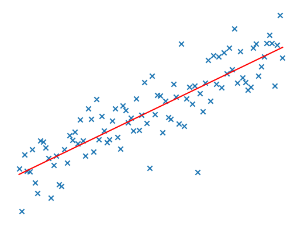
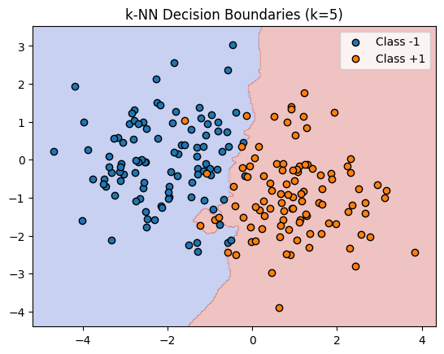
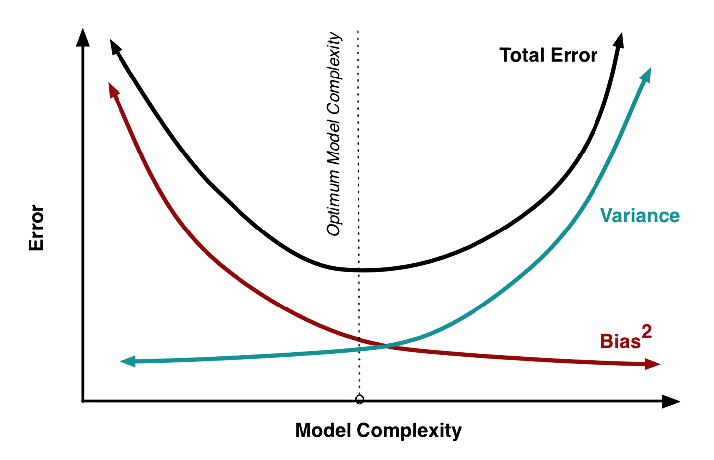
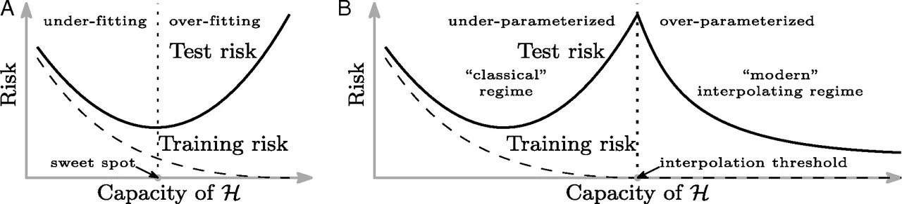
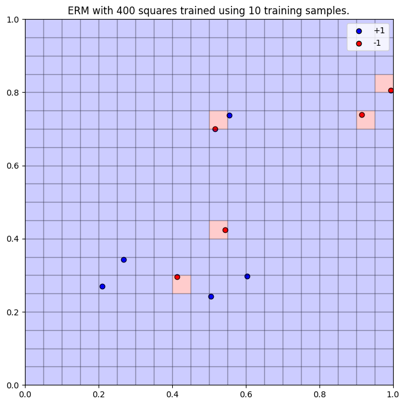
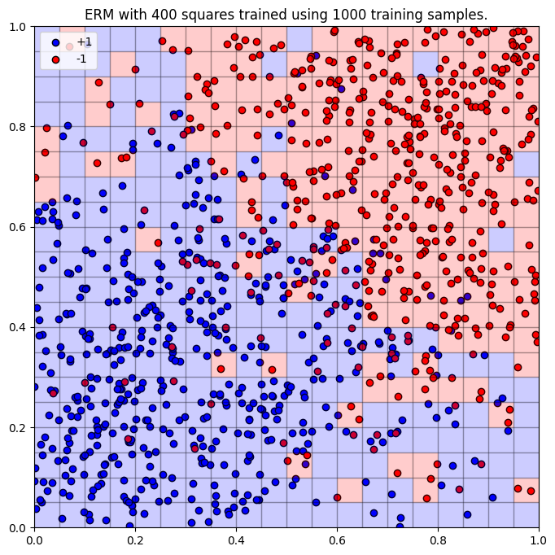
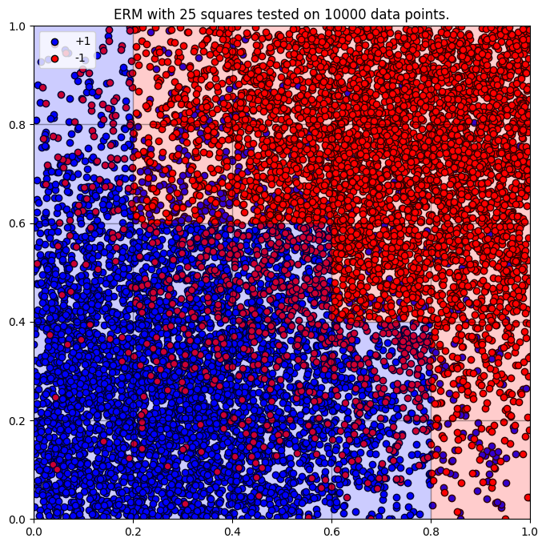
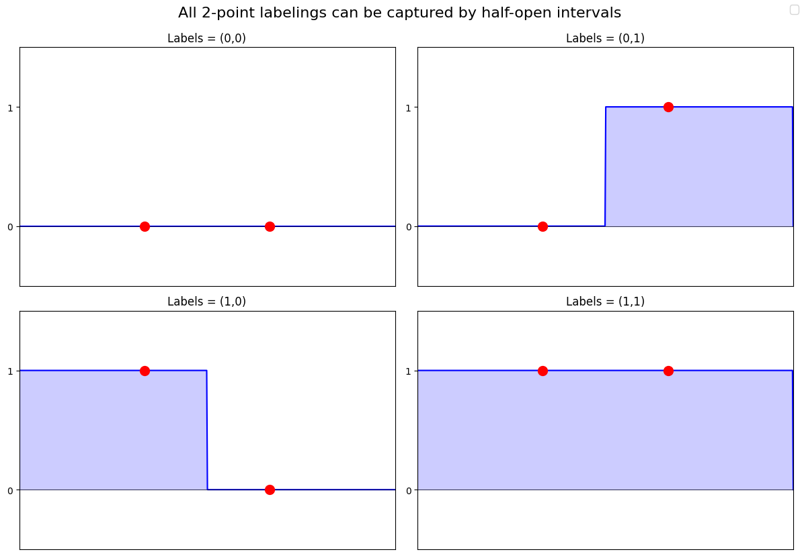
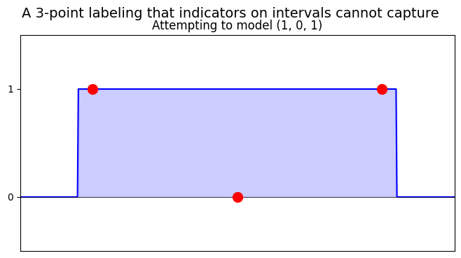
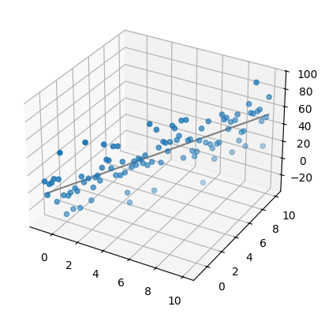

# Background
## Acknowledgement
*Much of the content here is drawn from Warwick University's Mathematics of Machine Learning lecture course (2023-24), taught by Clarice Poon. These lecture notes are not publicly available. I'd like to thank Clarice for inspiring this post based on her teaching. Please see the references section for my best efforts at proper attribution. I'll branch off into more original territory in the future!* 
## Personal Context
This post is an experiment. I adored my time studying [Clarice Poon's](https://cmhsp2.github.io/) [Mathematics of ML](https://warwick.ac.uk/fac/sci/maths/currentstudents/modules/ma3k1/) during my final year at Warwick (23-24). As I wrestled with the material - like all well taught maths modules - slowly, from the mist, a beautiful story emerged! As a person who thinks in narrative, I've always wondered: what does it look like to actually write down *how* I understand this kind of technical content? After a year out of formal education working in [DESNZ](https://www.gov.uk/government/organisations/department-for-energy-security-and-net-zero), I wanted my mathematical itch scratched...hence this post. 

One of my [favourite lecturers](https://warwick.ac.uk/fac/sci/maths/people/staff/mario_micallef/) said '*mathematics is compressible*'. You can take 20 pages of formalism, wrap it up into a single definition, and then when defining some new object, all that complexity can be implicitly assumed! In this post, I've attempted to unwinded that density resulting in a lengthly tract that's frustratingly but inevitably non-self-contained. I'll choose to embrace this meaning the intended audience isn't particularly targeted. To the serious mathematician, I'll be labouring the obvious; to the non-technical, I won't shy away from the symbols. 

Regardless, I've enjoyed dipping my toes back into familiar mathematical waters. I hope this post can form a personal benchmark for what it means for me to actually understand a particular topic, giving me something to measure against when I venture off into yet-uncharted territory. 

Enough faff - let's get on with it! 
## Why does Statistical Learning Theory matter?
SLT offers a rigorous mathematical foundation for 'classical' machine learning. While this 30 year old theory isn't exactly cutting-edge and wouldn't be used in practice explicitly, the ideas developed here do form the foundational concepts motivating the current deep-learning paradigm. Besides, purely aesthetically, the mathematical arguments are quite pretty! Hence, I think reminding myself of the foundations of ML before starting a role in Industry will be time well spent.

Of the different types of learning (supervised, unsupervised, reinforcement, etc.), SLT is neatest when describing supervised learning. In this post, I'll further simplify to the case of binary classification (photo of a cat or dog) and build up some theory.
## The set-up
Here, our goal is to make a machine learn from labelled categorical data. More precisely, we want to learn a function $h$ that will take us from our input vector of features $X$ (the words in an email, a customer transaction history, an image etc.) to their corresponding labels (is the email spam or not? is this customer committing fraud or not? is the image a cat or a dog?). If we learn $h:\mathcal{X}\rightarrow \mathcal{Y}$ 'well enough', then we can pass some unlabelled $X$ to $h$ and it'll split out a label $Y$ which we can use to make predictions about the world. 

A small note that our actual data $(X,Y)$ are modelled as random variables, sampled from some probability distribution $\mathcal{X}\times\mathcal{Y}$ with joint measure $P_0$. In the real world, we don't know the statistical distribution of the english language or images of boats. The idea in this formalism of ML is to *learn* this underlying and unknown distribution $P_0$ from data we can collect from the world.
# The Very Basics
SLT is all about understanding how well our function $h$ is performing. Are we modelling the underlying data accurately? In order to do this, we have build up some key tools. Please do skip to the interesting stuff if you know this already! `LINK TO LATER ON`
## The Hypothesis Class
Firstly, what is this function $h$? It's the 'model' that everyone talks about. But what does it look like? What shape does it take? We need to draw it from somewhere, to set the guardrails on how the function can look so that the parameters *inside* the function can then be learnt. We call this space of possible functions the hypothesis class, $\mathcal{H}$. 

As a concrete example, $\mathcal{H}$ could look like an indictor function on the interval $[a,b]\subset\mathbb{R}$. An $h\in\mathcal{H}$ would have two parameters, $a$, $b$ on the real line ($a<b$) and would be defined as follows, simply 'indicating' whether the datapoint $x\in\mathbb{R}$ lies inside the interval $[a,b]$ or not. 
$$
h_{a,b}(x)=
\begin{cases} 
1 & \text{if } x\in[a,b] \\
0 & \text{if } x\notin[a,b]
\end{cases}
$$
So here, our hypothesis class $\mathcal{H}$, is the set of all indicator functions on the real line. Formally, 
$$
\mathcal{H}=\{h_{a,b} ; a,b\in\mathbb{R}, a<b\}
$$
In the real world, $\mathcal{H}$ obviously gets a lot more exciting. For example, the hypothesis class for an LLM would be the architecture of a transformer and $\mathcal{Y}$ would be a probability distribution of tokens, permitting sampling to predict the next word. After defining this model class, you can then do your learning on the parameters *inside* this model class. 
## Loss
We now need some way to quantify how well our chosen function $h\in\mathcal{H}$ is performing. This is how we can understand how to improve our model. `LINK TO INTERESTNG NOTE ON LOSS FUNCTIONS`

If $h$ *is* performing well using its current parameters, then it has learnt the phenomena is it modelling. If $h$ is *not* performing well given its current parameters, then we can use that information to point the parameters of $h$ in a better direction.  If we keep doing this (using iterative stochastic gradient descent and backpropogation) `LINK TO DEEP LEARNING SECTION`, the model will keep tweaking its parameters, getting better and better...eventually leading to some pretty stellar ML models. 

To assess performance, we need a *loss function*. This compares the model's predicted label to the real data. If we're correct (or close to correct), then the error (or loss) is low. If our model predicted a label that was *far* from the original value, then our loss in high. 

Formally in our context of binary classification, the loss function $l:\mathcal{Y}\times\mathcal{Y}\rightarrow \mathbb{R}_{}$  takes in two labels:
1) A real label from data, $y$, and
2) A label predicted using our model $\hat{y}$
and outputs a numerical score telling us how good the guess is. 

In our simple context of binary classification, this loss function $l$ could be the simple 'unit loss': if our predicted label is correct, $l$ spits out a 0 - no punishment! If our predicted label is incorrect, then $l$ spits out a 1.  
$$
l(h(x),y)=
\begin{cases}
0 & h(x)=y \\
1 & h(x)\neq y
\end{cases}
$$
## Risk
Now we can quantify the performance of our model $h$, how should we go about choosing it? 

We want our model to perform well on *all* the data, $X$, that could be thrown at it. In other words, we want to minimise the amount of times $h$ is expected to be wrong. In the jargon, we want to minimise the risk $R(h)$. 

Formally, in terms of our random variables $(X,Y)$ drawn from the underlying probability distribution $\mathcal{X}\times\mathcal{Y}$, this is the expectation of the loss function. Literally, 'how often are we expected to be wrong?'
$$
R(h)=\mathbb{E}[l(h(X),Y)]
$$
Digging into the details of what this expectation actually means, for some fixed hypothesis $h$ that we've chosen, we want to travel around our sample space and add up the error our chosen function would give us at each point. By adding up the error at each of the points in our sample space (or integrating), this gives us our expected error or risk:
$$
R(h)=\int_{(x,y)\in(\mathcal{X}\times\mathcal{Y})}l(h(x),y)\text{d}P_0(x,y)=\mathbb{E}[l(h(X),Y)]
$$
## The Bayes Classifier
Now we have the goal: find an $h$ that minimises our risk $R(h)$, the natural next question would be, 'what is the best $h$ we can pick?' 

In our case of simple binary classification (the only possible labels being $\mathcal{Y}=\{0,1\}$, there is an answer! The function that minimises our risk is simply defined to be the *Bayes Classifier*, $h_*$. Formally (assuming this exists and is unique)
$$
h_*:=\text{argmin}_hR(h)
$$
Importantly, there is *no restriction* on what $h_*$ looks like, or where is is drawn from. The Bayes classifier is simply defined to be the best we can ever possibly do from all possible functions $h$. 
## The Empirical Risk
None of this has been terribly practical so far. We now turn to the actual data which could be collected in the world (spam emails, cat pictures etc). Say we have $n$ data points $(X_i,Y_i)_{i=1}^n$ which have been drawn identically and independently (iid) from our underlying probability distribution $P_0$. How do we quantify how well our chosen hypothesis $h$ is performing on this actual data?

While before, we integrated over the space of all possible values for $X$, we now have $n$ discrete points, so can just take the average over them! This is the empirical risk $\hat{R}(h)$:
$$
\hat{R}(h)=\frac{1}{n}\sum_{i=1}^n l(h(X_i),Y_i)
$$
From this, again, we ask the question: 'what is the best possible function we can pick to minimise this *empirical risk*'?

While the Bayes classifier was the best possible function we could ever pick to minimise the total loss, we now restrict to only searching over functions *inside our chosen hypothesis class*, $\mathcal{H}$. Now, we are asking the question, 'what is the best function we can possibly choose *inside* our hypothesis class, based on the data we have available?' 

This is the *empirical risk minimiser*, defined to be
$$
\hat{h}\in \text{argmin}_{h\in\mathcal{H}} \hat{R}(h)
$$
This is a far more practical question to answer. We have our chosen hypothesis class $\mathcal{H}$, we have our $n$ data points $\{(x_i,y_i)\}_{i=1}^n$, we just need to pick the best $h$ given these restrictions. 
## Basic ERM examples
To make this concrete, I'll show how we can find the ERM in some particular examples.
### Linear Regression
Classic! Important! For this example, we'll take the case where our feature space $\mathcal{X}=\mathbb{R}^p$ and we have a regression (rather than classification problem) so $\mathcal{Y}=\mathbb{R}$. For our class of models, we'll just pick straight lines. If $p=2$ this would be the classic $y=mx+c$. Our hypothesis class is the $p$-dimensional analogue.
$$
\mathcal{H}=\{x\mapsto x^Tw+b:w\in\mathbb{R}^p, b\in\mathbb{R} \}
$$
For our loss function, will just take $l(z,y)=(z-y)^2$ and we'll collect $n$ data points from the real world: $\{(x_i,y_i) \}_{i=1}^n$. We now want to ask, what is the model in our hypothesis class that will minimise the empirical risk on this dataset? I.e. what are the values for $w$ and $b$ that minimise $\hat{R}(h)$?

Well, our empirical risk is simply $\hat{R}(h)=\frac{1}{n}\sum_{i=1}^n l(h(x_i),y_i))$, so using the definition of our loss function and hypothesis class, we want to find the $(w,b)$ that minimise $\frac{1}{n}\sum_{i=1}^n (y_i-x_i^Tw-b)^2$. How can we do this?

It turns out this problem has a neat closed form solution! If we package up our feature vector data $x_i$ into a matrix $X\in\mathbb{R}^{n\times (p+1)}$ with $n$ rows $(x_i^T, 1)$ of length $p+1$, and put our $y_i$ into a single vector $Y\in\mathbb{R}^n$, then our optimal parameters based on our data $\{ x_i,y_i \}_{i=1}^n$ are
$$
(\hat{w},\hat{b})=(X^TX)^{-1}X^TY
$$
See the annex for the details `LINK TO ANNEX` - the point is to illustrate how the empirical risk minimiser framework can fit into the framework of classical statistics: finding optimal model parameters based on data. E.g. for $p=2$

### K-Nearest Neighbours
If we return to binary classification, another classic example to demonstrate the practicality of the ERM framework would be k-NN. Here, we have $Y\in\{-1,1\}$ and given some new point in our space, we'll look at the $K$ nearest points to it and assign our new data point the most common label. The $K$ nearest neighbours simply vote on the class the new point.  

Say you have training data $(x_i,y_i)$ and you want to classify some new point $\bar{x}$. You can compute the distance between $\bar{x}$ and all the $\{x_i\}_{i=1}^n$, and store this in a vector $d_{\bar{x}}=(||x_i-\bar{x}||)_{i=1}^n$. Then, find the index of the $K$ smallest entries in this vector and call those $I_{\bar{x}}$. Our guess is then the vote of these $K$ nearest points, $\{x_i\}_{i\in I_{\bar{x}}}$:
$$
h({\bar{x}})=\text{sign}\left(\frac{1}{K}\sum_{i'\in I_{\bar{x}}}y_{i'}\right) 
$$
And our corresponding hypothesis class are the so called 'Voronoi regions' $\{V_j({x})\}_{j=1}^n$ defined to be regions that have the same $K$ nearest neighbours as the point $x$. We can compute this ERM explicitly from our training data. For example:

### Deep Learning
The examples above show how to find the ERM from data for simple $\mathcal{H}$. For real-world deep learning models with potentially billions of parameters, our goal remains the same: find the model in our hypothesis class which minimises the risk 
$$
\min_{h\in\mathcal{H}}\mathbb{E}[l(h(X),Y)]
$$
For these more general models, there isn't an explicit analytic solution. Hence, we need to devise an algorithms which can slowly improve the parameters of the model, moving through the space of all possible models, $\mathcal{H}$, to (hopefully) land at loss-minimum. That method is *stochastic gradient descent*.

Formally, for some $f:\mathbb{R}^p\rightarrow\mathbb{R}$, (set to be the loss applied to data) we want to find some method to find a sequence of model parameter's $w_k$ which converge to the minimiser $w^*=\text{argmin}_{w\in\mathbb{R}^p}f(w)$. To construct that sequence of minimisers we can follow this rule:
1. Initialise with $w_0\in\mathbb{R}^p$
2. Iterate using some carefully chosen step size $\tau_k$, sampling $i_k$ iid from $\text{Uniform\{1,...,n\}}$

$$w_{k+1}=w_k+\tau_k\nabla f_{i_k}(w_k)$$

Obviously, there's a lot more to model training than this! The point here is to demonstrate methods which can practically compute an ERM from data in the real world.

Now we have a feel for why finding an ERM is useful and how we can do this in practice, we return to our central question: how do we quantify how well our model is performing? The empirical risk on our current data may be low, but if we then applied this model to unseen data, would it continue to perform as well? How should we go about formalising this difference?
# Excess Risk
We've seen what it looks like to pick a model class (e.g. regression, K-NN) and then find the best possible parameters for that model on our data. This is the all important *empirical risk minimiser*, $\hat{h}\in\text{argmin}_{h\in\mathcal{H}}\hat{R}(h)$. This is great, but we need some context. For this ERM, how good is it? How much better could we do? We need some more definitions...

We've seen that the *Bayes Classifier*, $h_*=\text{argmin}_{h}R(h)$, is the best model we could ever possibly pick. We can't do better than a total risk of $R(h_*)$. So, we can set this as our baseline and define the *excess risk* for some estimator $\hat{h}$ to be 
$$
\mathcal{E}:=R(\hat{h})-R(h_*)
$$
This captures the error in our model class from our 'best case scenario', $h_*$. 

It's worth noting that due to various so called ['no free lunch' theorems](https://en.wikipedia.org/wiki/No_free_lunch_in_search_and_optimization), without assumptions on our underlying probability distribution, it's impossible to find some empirical risk minimisers which perform arbitrarily well on that data. There's no universal method for learning. 

How does this excess risk relate to our all important *empirical risk minimiser* $\hat{h}\in\text{argmin}_{h\in\mathcal{H}}\hat{R}(h)$ that we've been computing from our data in concrete examples? 
## The decomposition of excess risk
For our ERM, we picked a chosen hypothesis class $\mathcal{H}$. This set the guardrails - the space of possible allowed models, and we found our 'best-guess', $\hat{h}$ inside this space. But this framing begs the question, was this the right space? Is our chosen model class expressive enough to actually find a good ERM? Even, is our chosen model class too expressive?

While our empirical risk minimiser found the model in our hypothesis class with the lowest risk on our *training data*, there could be models *in our hypothesis class* that have lower overall risk. Formally, we can define this (assuming it exists!) as
$$
\bar{h}=\text{argmin}_{h\in\mathcal{H}}R(h)
$$
Correspondingly, we can use this notion to decompose our excess risk. We want to split these two related, but separate separate ideas:
- First, how well is our ERM $\hat{h}$ performing *inside* our chosen model class? We want to quantify the difference between the current performance of our model on our data, and the best this chosen model class can do on all possible data. This is called the *estimation error*. 
- Second, how good is our chosen hypothesis class $\mathcal{H}$ compared to the best we can ever do over *all possible* hypothesis classes? This is the *approximation error*.

Putting these ideas together in the symbols, we have the following formula:
$$
R(\hat{h})-R(h_*)=
\underbrace{R(\hat{h})-\inf_{h\in\mathcal{H}}R(h)}_
{\text{estimation error}}
+\underbrace{\inf_{h\in\mathcal{H}}R(h)-R(h_*)}_
{\text{approximation error}}
$$
Thinking about what this means in terms of model selection, the larger (and more expressive) you make your hypothesis class $\mathcal{H}$, the smaller the approximation error will be. However, if you make your hypothesis class too large, then - depending on your access to data and ability to find $\hat{h}$ - your estimation error could increase. Hence, you want to choose your hypothesis class which balances performing well on the training data - low $R(\hat{h})$ - with generalising well to all data, i.e. avoiding overfitting. 
### Classic Interpretation
Mapping this onto the [classic bias vs variance trade-off graph](https://en.wikipedia.org/wiki/Bias%E2%80%93variance_tradeoff) from statistics, we can say
- **Estimation error** $\approx$ **Variance**: as $\mathcal{H}$ complexity grows (up to DL-complex), there is more and more space for your ERM trained from data, to diverge from the best possible model within your hypothesis class. 
- **Approximation error** $\approx$ **Bias$^2$**: as model complexity grows, the best model possible *within* $\mathcal{H}$ slowly converges towards the best ever possible model, the Bayes Classifier, $h_*$. 

### Note on the connection to Deep Learning and modern research
*With the advent of deep learning, this classical paradigm has been blown out of the water! By selecting an extremely expressive hypothesis class (transformers etc) and spending huge amounts of computing resource tuning the parameters of the model using vast quantities of data (the entire internet...) companies have been able to find ERMs with near zero excess risk. Blatantly stealing the key image from [Belkin, Hsu, Ma, and Mandal's 2019 paper](https://www.pnas.org/doi/10.1073/pnas.1903070116#con4), you can see that with model ML models, the classical graph has a long tail heading right:*

*Finally, finding an explanation for this seems to still be an active area of research. Interestingly, in 2022, [Sébastien Bubeck](https://dblp.uni-trier.de/search/author?author=S%C3%A9bastien%20Bubeck "DBLP author search") and [Mark Sellke](https://dblp.uni-trier.de/search/author?author=Mark%20Sellke "DBLP author search") published a [paper](https://arxiv.org/abs/2105.12806) which made some theoretical in-roads using some of the tools and techniques that I'll introduce later in this post. `LINK TO LATER TOOLS` Neat!*
# Controlling the Excess Risk
We've seen that the excess risk is the sum of the *estimation error* (how well is our model performing inside the hypothesis class?) and the *approximation error* (how well is our model class performing against all possible model classes?). To make sensible choices about $\mathcal{H}$, it'd be good to understand exactly how the excess risk is effected by

1. The complexity of our model class
2. The number of data points we have access to

To control the *approximation error*, you need to make some assumptions about the Bayes classifier and underlying data which I won't cover in this post. Instead, we'll turn our attention to controlling the *estimation error*. 
## Controlling the Estimation Error
How can we precisely control the estimation error of our ERM in terms of the data $(x_i,y_i)_{i=1}^n$ that we have access to? If we call $\bar{h}=\text{argmin}_{h\in\mathcal{H}}R(h)$ and assume that it exists, then we can bound the estimation error as follows:
$$
\begin{align}
R(\hat{h})-\inf_{h\in\mathcal{H}}R(h)
&= R(\hat{h})-R(\bar{h}) \\
&= R(\hat{h})-\hat{R}(\hat{h})+
\underbrace{\hat{R}(\hat{h})-\hat{R}(\bar{h})}_
{\leq 0}+\hat{R}(\bar{h})-R(\bar{h}) \\
&\leq R(\hat{h})-\hat{R}(\hat{h})+\hat{R}(\bar{h})-R(\bar{h}) \\
&\leq 2\sup_{h\in\mathcal{H}}\left|R(h)-\hat{R}(h)\right| \\
\end{align}
$$
Note that because $\hat{h}$ is our ERM, then $\hat{R}(\hat{h})=0$ which forces $\hat{R}(\hat{h})-\hat{R}(\bar{h})\leq 0$. The final inequality follows because by taking a supremum over our set, we certainly increase the value of the expression. This calculation bounds the estimation error in terms of our empirical risk which is far more useful that dealing with that pesky infimum. 

We can now use this to ask a more precise question: what's the chance that our estimation error exceeds some threshold? We would like to upper bound the following probability:
$$
\mathbb{P}\left(\sup_{h\in\mathcal{H}}\left|R(h)-\hat{R}(h)\right|>t\right)\leq\delta
$$
In effect, this asks, how often this choice of $\mathcal{H}$ leads to unacceptably large estimation errors? We want to understand, the conditions required for the estimation error to exceed some given mistake tolerance $t$ with less than probability $\delta$. These are so called [PAC](https://en.wikipedia.org/wiki/Probably_approximately_correct_learning) bounds: $\delta$-probably, $t$-approximately correct. 

Clearly bounding these probabilities will depend on our chosen hypothesis class. Hence, we'll split into two cases...
### Finite Dimensional Hypothesis Classes
Model classes in the real world are not finite! However, attempting this bound on the estimation error when $|\mathcal{H}|<\infty$ will arm us with some useful tools we need to tackle the trickier case of $|\mathcal{H}|=\infty$. So, how can we bound $\mathbb{P}[R(\hat{h})-R(\bar{h})>t]<\delta$?

If we had the case where $\hat{h}=\bar{h}$ (i.e. the ERM was the best model inside our hypothesis class), then $R(\hat{h})-R(\bar{h})=0$, so we can say that $\mathbb{P}[R(\hat{h})-R(\bar{h})>t]=\mathbb{P}[R(\hat{h})-R(\bar{h})>t,\hat{h}\neq \bar{h}]$. Now that we have clear cases for $\hat{h}$, we can use our nifty bound involving the *empirical risk* (derived above) to upper bound the probability into two parts. 
$$
\mathbb{P}[R(\hat{h})-R(\bar{h})>t]\leq\underbrace{\mathbb{P}[R(\hat{h})-\hat{R}(\bar{h})>t/2,\hat{h}\neq \bar{h}]}_{(*)}+\underbrace{\mathbb{P}[\hat{R}(\bar{h})-R(\bar{h})>t/2]}_{(**)}
$$
#### Second Term
Looking at the second term first, what does this mess of symbols actually mean? Looking at the event we're interested in (the bit inside $\mathbb{P}$), $\hat{R}$ is our empirical risk (based on the data) and $R(\bar{h})$ is the *expectation* of our loss function over our space. Because each data point $(x_i,y_i)$ is drawn iid from our latent space, we can pull out a factor of $1/n$ and sum over this expectation yielding
$$
\hat{R}(\bar{h})-R(\bar{h}) = \frac{1}{n}\sum_{i=1}^nl(\bar{h}(x_i),y_i)-\mathbb{E}[l(\bar{h}(x_i),y_i)]
$$
There is some neat structure here! We're taking some object indexed by $i$, subtracting it's average and then averaging over the index. I wonder if there are some mathematical tools that can help us out?

There are! We can open a probability textbook and nab this fantastic tool called *Hoeffding’s inequality* (I'll leave [Vershynin](https://www.math.uci.edu/~rvershyn/papers/HDP-book/HDP-book.html) to the details). It gives us quantitive tail bounds for averages of independent, bounded random variables. 

Namely, if $W_1,\ldots,W_n$ are independent random variables with $a_i\leq W_i \leq b_i$ for all $i$, then for all $t\geq0$, their average $Z:=\frac{1}{n}\sum_{i=1}^nW_i$ satisfies the following single tailed concentration inequality. 
$$
\mathbb{P}(Z-\mathbb{E}[Z]\geq t)\leq \exp\left(-\frac{2n^2t^2}{\sum_{i=1}^n(b_i-a_i)^2}\right)
$$
Applying this to our situation, our independent random variables $W_i$ are these differences between the loss at our data point and the expected loss at that point $l(\bar{h}(x_i),y_i)-\mathbb{E}[l(\bar{h}(x_i),y_i)]$ when using the 'best-ever' hypothesis class $\bar{h}$. If we assume that these random variables are bounded - say $W_i\in[0,L]$ - then we can directly apply Hoeffding's to bound $(**)$ as follows:
$$
\mathbb{P}[\hat{R}(\bar{h})-R(\bar{h})
\geq t/2]\leq\exp\left(-\frac{2n^2(\frac{t}{2})^2}{nL^2} \right)
= e^{-\frac{nt^2}{2L^2}}
$$
#### First Term
Now, that $(**)$ has been neatly bounded, we want to turn our attention to $(*)$ and get something similar, however, this is more difficult! Whereas before $\bar{h}$ was a fixed function, now we search over the space where $\hat{h}\neq\bar{h}$. We want to upper bound
$$
(*)=\mathbb{P}[R(\hat{h})-\hat{R}(\bar{h})\geq t/2,\hat{h}\neq \bar{h}]
$$
Now, recall that $\hat{h}=\text{argmin}_{h\in\mathcal{H}}\hat{R}(h)$, a very specific choice for our $h$, so, if we loosen our choice of $h$, we can certainly bound this probability above - just pick whichever $h$ in our hypothesis class that maximises the probability. 
$$
\mathbb{P}[R(\hat{h})-\hat{R}(\bar{h})>t/2,\hat{h}\neq \bar{h}]
\leq
\mathbb{P}[\exists h\in\mathcal{H}/\{\bar{h}\}:R(h)-\hat{R}(h)\geq t/2]
$$
From some classic set theory, the RHS expression says 'what's the probability that there exists some $h$ in our hypothesis class such that a condition holds'. If we think in terms of events, there existing such an $h$ that satisfies the condition is really the same as saying 'the first $h$ in our class could satisfy our condition' *or* 'the second $h$ in our class could satisfy the condition' *or* 'the third $h$ in our class could do it', or the fourth, etc. So we can write this RHS event as a big union over all possible $h\in\mathcal{H}/\{\bar{h}\}$. 
$$
\begin{align}
\mathbb{P}[\exists h\in\mathcal{H}/\{\bar{h}\}:R(h)-\hat{R}(h)\geq t/2]
&=\mathbb{P}[\bigcup_{h\in\mathcal{H}/\{\bar{h}\}} R(h)-\hat{R}(h)\geq t/2] \\
&\leq \sum_{h\in\mathcal{H}/\{\bar{h}\}}\mathbb{P}[R(h)-\hat{R}(h)\geq t/2] \\
\end{align} 
$$
The second inequality follows from the union bound: for just two events $A$ and $B$, $\mathbb{P}[A\cup B]\leq\mathbb{P}[A]+\mathbb{P}[B]$. Sum up everything - discount the overlap! 

Neatly, this RHS is exactly what we've bounded already for $h=\bar{h}$. Because $h\in\mathcal{H}/\{\bar{h}\}$ is now fixed and being summed over, we can apply that same Hoeffding bound to argue that
$$
\sum_{h\in\mathcal{H}/\{\bar{h}\}}\mathbb{P}[R(h)-\hat{R}(h)\geq t/2] 
\leq
(|\mathcal{H}-1|)\exp\left(-\frac{nt^2}{2L^2}\right)
$$
#### Putting Together
Summing together $(*)+(**)$, we can get back to answering our original question: how is the estimation error effected by the cardinality of our hypothesis class $\mathcal{H}$ and the number of data points $n$ we have access to find our ERM? 
$$
\mathbb{P}[R(\hat{h})-R(\bar{h})>t]
\leq
|\mathcal{H}|\exp\left(-\frac{nt^2}{2L^2}\right)
\leq
\delta
$$
Running through these parameters, we can measure our model-error threshold with the *chosen* parameter $t$, $\mathcal{H}$ is our model choice, $n$ is the number of data points we have access to and, finally, we can ask the question, when is this probability *certainly* less than some chosen $\delta$?

Rearranging, this happens iff $t^2\geq\frac{2L^2\log(|\mathcal{H}|/\delta)}{n}$, so putting this together
$$
\mathbb{P}\left[R(\hat{h})-R(\bar{h})>\underbrace{L\sqrt{\frac{2\log(|\mathcal{H}|)+2\log(\delta^{-1})}{n}}}_{\text{function of known parameters}}\right]
\leq
\delta
$$
This is cool! Interpreting what it means, this inequality says that we can understand how the estimation error of our model is effected by the parameters we can choose (hypothesis class $\mathcal{H}$ of model, amount of training data $n$).
#### Drawing out the implications
To make this a bit more actionable, we can use the same tools from above to make the following estimates:
$$
\begin{align}
\mathbb{P}(\forall h\in\mathcal{H}, R(h)-\hat{R}(h)\leq t)
&= 1-\mathbb{P}(\exists h\in\mathcal{H},R(h)-\hat{R}(h)>t) \\
&\geq 1- \sum_{h\in\mathcal{H}}\mathbb{P}(R(h)-\hat{R}(h)>t) \\
&\geq 1- |\mathcal{H}|\exp(-2nt^2/L^2)
\end{align} 
$$
The first inequality just uses the union bound, the second uses Hoeffding with the negatives reversing the inequalities. 

We can now ask the key question: how often will our model choice have an unacceptably large error? If we consider the error bound we're interested in, 
$$
\mathbb{P}(\forall h \in\mathcal{H},R(h)-\hat{R}(h)\leq t)\leq 1-\delta
$$
I.e. if $\delta$ is small, then the probability that our model produces $t$-acceptable results is high. We can then ask for what $t$ is this achieved? Plugging our bounded inequality into the question above, we can see that if we set 
$$
t=\sqrt{\frac{L^2\log(|\mathcal{H}|/\delta)}{2n}}
$$
Then, with probability at least $1-\delta$, for *all* $h\in\mathcal{H}$, we can bound the risk of our model choice by terms that we can calculate:
$$
R(h)\leq\hat{R}(h)+\sqrt{\frac{L^2\log(|\mathcal{H}|/\delta)}{2n}}
$$
As this holds for all $h$, it certainly holds for our empirical risk minimiser $\hat{h}$ (the best we can do on our data inside our model class). 
#### Interpretation
Concretely, we now have a better understanding of the risk of our ERM. We previously had this object we want wanted to understand $R(\hat{h})$, effectively asking, once we've found the best model possible in our class, how well will it perform? This is a tricky question! We don't know the underlying probability distribution of our data so we can't compute $R(\hat{h})=\mathbb{E}[l(\hat{h}(X),Y)]$. 

Now, we can bound the object we want to understand by other objects which can be calculated *without* knowing the underlying probability distribution: the empirical risk which is calculated from data $\{(x_i,y_i)\}_{i=1}^n$ and our $t$ term which is a function of know parameters defined during model selection.

So, during model selection, we can use inequalities like these to inform decisions around model architecture. This *structurally* minimises the risk, ensuring we've set the best bounds on the problem before then *empirically* minimising the risk on the training data available to derive our $\hat{h}$.

*In the real world, these bounds are too loose to be of practical value. Other techniques like cross validation can give a better measure of generalisation for modern model architectures. Remember: this is background theory rather than modern practice in Industry.* 
#### Simple Application Example
Let's say we live on the bounded plane $\mathcal{X}=[0,1)^2$ and want to learn a classifier who can predict the label of points with $\mathcal{Y}=\{-1,1\}$. Let's say we have access to $n=1000$ data points, drawn from some unknown distribution $(X_i,Y_i)\stackrel{iid}{\sim} P_0$. The data looks like this

For our hypothesis class, we'll slice up the unit square into $m^2$ little boxes $R_j$ of length $1/m$ of the form $[r/m,(r+1)/m]\times [s/m,(s+1)/m]$ with $r,s = 0,...,m-1$. The hypothesis class is all possible indicator functions on these boxes:
$$
\mathcal{H}=\left\{h(x)=\sum_{j=1}^{m^2}s_j\mathbb{1}_{R_j}(x) \text{ ; } s\in\{-1,1\}\right\}
$$
For example, if we chose $m=5$ then a random example of an $h\in\mathcal{H}$ could be this, predicting whether a point will be red or blue. 

Note that each of the $m^2$  squares has two label choices, so $|\mathcal{H}|=2^{m^2}$. For this simple example, the ERM, $\hat{h}=\text{argmin}_{h\in\mathcal{H}}\hat{R}(h)$, will just be the most common label inside each square:
$$
\hat{h}(x)=\sum_{j=1}^{m^2}\bar{Y_j}\mathbb{1}_{R_j}(x)  
$$
where $\bar{Y}_j = \text{sign}(\sum_{X_i\in R_j}Y_i)$. An example ERM, calculated from data, would look like this:

#### Example of structural risk minimisation
Let's say we're trying to pick our model parameter $m$ such that on our $n$ labelled data points, we can have 95% confidence ($\delta=0.05$) that our ERM will have an 'acceptable' error rate. From the language used earlier, we want to guarantee
$$
\mathbb{P}(R(\hat{h})-\hat{R}(\hat{h})\leq t)\leq 1-\delta
$$
Because our data lies on the unit square, the random variables we used inside Hoeffding will be bounded by $L=2$, so we can use the bound we developed above with $|\mathcal{H}|=2^{m^2}$ to say that the following inequality will hold with probability at least $(1-\delta)$%
$$
R(\hat{h})\leq
\hat{R}(\hat{h})+
\sqrt{\frac{2m^2\log(2)+2\log(\delta^{-1})}{n}} \\
$$
Why is this useful? Let's consider different examples with $\delta=0.05$:

1. If we had very little training data, say $n=10$, and we picked a very expressive model class, perhaps $m=20$, then the $t$-term in our 95% confidence bound evaluates to $7.5$, meaning the risk of miscalculation is ludicrously high! Therefore, when applied to unseen data, this ERM will perform very poorly, only classifying the blue points correctly (without data, the ERM sets the square to blue as default).

2. Equally, if we have access to lots of training data, say $n=1000$, but retain model expressivity at $m=20$, then the $t$-term evaluates to $0.75$, meaning that we still can't be confident that every possible ERM will perform well on unseen data. We're actually slightly overfitting with a 19% accuracy on 10,000 unseen data points. 

If we consider the $t$-term and try to optimise over $m>0$, then we find that  
$$
\frac{\text{d}}{\text{d}m}{}\sqrt{\frac{2m^2\log(2)+2\log(\delta^{-1})}{n}}
>0\implies\text{risk increases with }m
$$
Therefore, to improve our 95% confidence bound, we should aim for as small an $m$ as is reasonable, following the principle of *[Occam's razor](https://en.wikipedia.org/wiki/Occam%27s_razor)*:

3. Setting $m=5$, our $t$-term further reduces to $0.2$ meaning we've structurally reduced the risk the furtherest out of the given examples. After computing an ERM on the $n=1000$ training data points, we see that $R(\hat{h})<0.35$. Testing this ERM on 10,000 data points shows this is our best model yet with a 14% accuracy rate, pictured below:

While far from current practice, this toy example helps to elucidate the basic theory of generalisation in the case of binary classification with finite dimensional hypothesis classes. 
### Infinite Dimensional Hypothesis Classes
Now, we want to consider the trickier case where $|\mathcal{H}|=\infty$. How could we control our estimation error here? 

Instead of studying the error directly, we'll consider the expected error, so applying an expectation to our previous bound, we want to study the following:
$$
\mathbb{E}[R(\hat{h})-R(\bar{h})]\leq\mathbb{E}[\underbrace{\sup_{h\in\mathcal{H}}R(h)-\hat{R}(h)}_{:=G}]
$$
I.e. we want to bound $\mathbb{E}[G]$. To do this, I'll briefly introduce two classical concepts in SLT: Rademacher Complexity and VC-dimension. While these concepts are dated, they're pretty (enough for me!) and help to contextualise the expressivity of modern model architectures.
#### Rademacher Complexity
For notational ease, we'll bind our data together into $(X_i,Y_i)=Z_i$ with $\mathcal{Y}=\{-1,1\}$ (we're still in the case of simple binary classification) and we'll take $\mathcal{F}$ to be our space of functions inside our hypothesis class, with the loss applied:
$$
\mathcal{F}:=\{(x,y)\mapsto l(h(x),y):h\in\mathcal{H} \}
$$
So, using this notation, we can unpick our definitions of risk and write $G$ neatly: 
$$
G=\sup_{f\in\mathcal{F}}\frac{1}{n}\sum_{i=1}^{n}\mathbb{E}[f(Z_i)]-f(Z_i)
$$
We're trying to formulate some notion of how complicated our hypothesis class is. We'll ask, 'on the $n$ data points, how many of the different labels can be achieved?'

This intuition leads us to the Rademacher complexity as follows: if $\mathcal{F}$ are a class of real-valued functions $f:Z\rightarrow\mathbb{R}$ and $z_1,...,z_n\in Z$ are data
- Call $\mathcal{F}(z_{1\colon n})=\{(f(z_1),...,f(z_n)):f\in\mathcal{F}\}\subset\mathbb{R}^n$. This is a collection of vectors in $\mathbb{R}^n$ giving the behaviours of $\mathcal{F}$ on the data $Z_{1:n}$.
- The empirical Rademacher complexity is defined to be 

$$
\hat{\mathfrak{R}}(\mathcal{F}(z_{1\colon n}))=\frac{1}{n}\mathbb{E}\left[\sup_{f\in\mathcal{F}}\sum_{i=1}^n\varepsilon_if(z_i)\right] $$

- The $\varepsilon_i$ are Rademacher random variables, i.e. $\mathbb{P}(\varepsilon_i=1)=\mathbb{P}(\varepsilon_i=-1)=\frac{1}{2}$. This measures how close your classifier on your dataset $f(Z_{1:n})$ is to random labels $\varepsilon_i$. E.g. if this is zero, then the model class is not particularly expressive, if this is 1 then the model class can achieve every possible labelling on $n$ data points.
- Taking $Z_1,...,Z_n$ to be random, you can view the empirical Rademacher complexity to be conditioned on the $Z_i$, so taking the expectation over $Z_{1\colon n}$, the Rademacher complexity is defined as 

$$\mathfrak{R}_n(\mathcal{F}):=\mathbb{E}\left(\hat{\mathfrak{R}}(\mathcal{F}(Z_{1\colon n}))\right)$$

This post is quite long enough, so I'll defer to [other resources](https://www.youtube.com/watch?v=tkJd2B98hII) that build intuition for the Rademacher complexity. 

For our purposes, we want to use this concept to control the estimation error
$$
\mathbb{E}[\underbrace{R(\hat{h})-\inf_{h\in\mathcal{H}}R(h)}_{\text{estimation error}}]\leq\mathbb{E}[{\sup_{h\in\mathcal{H}}R(h)-\hat{R}(h)}]=:\mathbb{E}G
$$
So, we would like to estimate the RHS. 
$$
\mathbb{E}G=\mathbb{E}\left(\sup_{f\in\mathcal{F}}\frac{1}{n}\sum_{i=1}^{n}\mathbb{E}[f(Z_i)]-f(Z_i)\right)
$$
#### Connecting the Estimation Error to the Rademacher Complexity
To make this estimate, the key idea is to exploit the following symmetry. 
- A random variable $X$ is symmetric if $X$ and $-X$ have the same distribution. 
- If $X$ is a symmetric random variable and $\varepsilon$ is a Rademacher random variable independent of $X$, then $X$ and $\varepsilon X$ have the same distribution. 

**Result**
Taking copies of random variables and bounding carefully yields the following result
$$
\mathbb{E}\left(\sup_{f\in\mathcal{F}}\frac{1}{n}\sum_{i=1}^{n}\mathbb{E}[f(Z_i)]-f(Z_i)\right)\leq2\mathfrak{R}_n(\mathcal{F})
$$
where $\mathcal{F}:=\{(x,y)\mapsto l(h(x),y)\text{ ; }h\in\mathcal{H}\}$. See the neat trick in the annex. `INSERT LINK TO ANNEX HERE`

**Connection to Estimation Error**
So overall, we can put these bounds together to see that the estimation error is controlled by the Rademacher complexity:
$$\mathbb{E}\left[ R(\hat{h}) − R(\bar{h})\right] ⩽ 2\mathfrak{R}_n(\mathcal{F})$$
Therefore, the problem of bounding the estimation error has been reduced to bounding the Rademacher complexity. How can we do this?
#### Connecting Rademacher Complexity to the Hypothesis Class
To gain an understanding of the expressivity of our function class $\mathcal{F}$, we want to count the different behaviours it is capable of on data $z_{1:n}$. This means counting $|\mathcal{F}(z_{1:n})|$.

On fixed input data $z_i=(x_i,y_i)$, how does the number of vectors in $\mathcal{F}(z_{1:n})$ relate to the number of vectors in $\mathcal{H}(x_{1:n})$? $\mathcal{F}$ simply applies a loss function to our data, so you wouldn't expect $\mathcal{F}$ to exhibit *more* behaviours on fixed data than $\mathcal{H}$. To make this formal, you can define an injection $\mathcal{F}\rightarrow\mathcal{H}$ via $l(h(x),y)\mapsto h(x)$. Then [following definitions](https://en.wikipedia.org/wiki/Injective_function), if you take two different elements of the domain, they cannot map to the same place: $(l(h(x_i),y_i)_{i=1}^n\neq(l(h'(x_i),y_i)_{i=1}^n\implies(h(x_i))_{i=1}^n\neq(h'(x_i))_{i=1}^n$. Hence, $|\mathcal{F}(Z_{1:n})|\leq|\mathcal{H}(Z_{1:n})|$.

If we unpick what's going on inside the Rademacher complexity term found above
$$
\mathfrak{R}_n(\mathcal{F}):=\mathbb{E}\left[\sup_{v\in{\mathcal{F}(z_{1:n})}}\frac{1}{n}\sum_{i=1}^n\varepsilon_iv_i\right] 
$$
We'll require some more tools from [High-Dimensional Probability](https://www.math.uci.edu/~rvershyn/papers/HDP-book/HDP-book.html). Particularly, *sub-gaussian random variables*, which are simply random variables with tails that that decay like the gaussian/normal distribution. There are [many equivalent definitions](https://en.wikipedia.org/wiki/Sub-Gaussian_distribution#Equivalent_definitions), but the most intuitive says that a random variable $X$ is called sub-gaussian if there exists a $C>0$ such that for every $t\geq0$,
$$
\mathbb{P}(|X|\geq t)\leq2\exp(-t^2/C^2)
$$
Think 'strong tail decays' and see the annex for details. Using some key facts about these objects, we can argue as follows:
1. The Rademacher random variables, $\varepsilon_i$ are sub-gaussian. `LINK TO ANNEX`
2. Sums of sub-gaussians are sub-gaussian (proof is definition pushing)
3. Therefore, we have an expectation of a supremum over a finite set. If we pull out a [probability textbook](https://eclass.uoa.gr/modules/document/file.php/MATH506/04.%20%CE%92%CE%BF%CE%B7%CE%B8%CE%AE%CE%BC%CE%B1%CF%84%CE%B1/HDP-book.pdf), there's a known result we can apply.

**Fact**: (proof in annex `LINK TO ANNEX` ) If $W_1,...,W_d$ are mean zero sub-gaussian with parameter $\sigma$, then 

$$\mathbb{E}[\max_{1\leq j\leq d}W_j]\leq \sigma \sqrt{2\log{d}}$$

**Application**: If we let $d=|\mathcal{F}(z_{1:n})|$ count the number of behaviours of our fixed data, assuming $l$ takes values in $[0,1]$, then as $\varepsilon_i\sim\text{SubGaussian(1)}$, we can set $W_j=\frac{1}{n}\sum_{i=1}^n\varepsilon_if(z_i)$ to be our mean zero sub-gaussian with parameter $\sigma=\frac{\sqrt{\sum_{i}1}}{n}$ and argue
$$
\hat{\mathfrak{R}}_n(\mathcal{F}(z_{1:n}))\leq\sqrt{\frac{2\log{|\mathcal{F}(z_{1:n})|}}{n}}\leq\sqrt{\frac{2\log{|\mathcal{H}(z_{1:n})|}}{n}}
$$
Combining with our previous work, we now have a bound on the estimation error!
$$
\mathbb{E}\left[ R(\hat{h}) − R(\bar{h})\right] ⩽ 2\mathfrak{R}_n(\mathcal{F})\leq 2\mathbb{E}\sqrt{\frac{2\log{|\mathcal{H}(z_{1:n})|}}{n}}
$$
However, if we consider limits as $n$ increases, this bound is only useful if $\log|\mathcal{H}|$ grows slower than $n$. So if $|\mathcal{H}|$ is exponential in $n$, then this already very loose bound will be entirely useless. Ideally, we'd want a hypothesis class which is polynomial in $n$...we need some methodology to analyse these different possibilities. 
#### Vapnik-Chernovenkis (VC) dimension
First, we should ask, 'what is the worst case scenario?' We're in the case of binary classification. So with $\mathcal{Y}=\{-1,1\}$, on $n$ data points, there are at most two different choices for each point $\mathcal{H}(x_{1:n})=\{h(x_i)\}_{i=1}^n$, Hence, our hypothesis class can express at most $|\mathcal{H}(z_{1:n})|\leq 2^n$ behaviours. This idea of counting behaviours of our hypothesis class can be formalised with the *VC dimension*.

Let $\mathcal{H}$ be a class of functions $h:X\rightarrow\{a,b\}$ with $a\neq b$. Then as long as $|\mathcal{H}|>2$
- We say $\mathcal{H}$ *shatters* data $x_{1:n}$ if $|\mathcal{H}(z_{1:n})|=2^n$. This means that every possible labelling is achieved on $x_{1:n}$.  
- For this hypothesis class, we can define $\Pi_{\mathcal{H}}(n):=\max_{x_{1:n}\in\mathcal{X}^n}|\mathcal{H}(x_{1:n})|$ to be the growth function or shattering coefficient. This measures the maximum number of behaviours of your hypothesis class on $n$ data points. As $n$ increases, the hypothesis class can express more and more behaviour until it reaches some cap based on the expressivity of $\mathcal{H}$.
- The VC dimension of $\mathcal{H}$ is 

$$\text{VC}(\mathcal{H}):=\sup\{n\in\mathbb{N}:\Pi_{\mathcal{H}}(n)=2^n\}$$ 
- This measures largest number of data points where the hypothesis class $\mathcal{H}$ can fully shatter the dataset $x_{1:n}$.

#### Example finding the VC dimension of a Hypothesis class
For example, if the hypothesis class consisted of half-open indicators on the real line 

$$
\mathcal{H}=\{\mathbb{1}_{[a,b)}(x):a,b\in\mathbb{R}\}
$$

with $\mathcal{X}=\mathbb{R}$ and $\mathcal{Y}=\{0,1\}$ then this hypothesis class can capture all the possible behaviours with $n=2$ data points. With $x_{1:2}$ we can have the following possible behaviours 

However $\mathcal{H}$ is not expressive enough to correctly model some behaviour on $n=3$ data points. For example, there is no $h\in\mathcal{H}$ which can satisfy $h(x_{1:3})=(1,0,1)^T$. Hence, $\text{VC}(\mathcal{H})=2$.  

Thinking about general data $x_{1:n}$, if we assume $x_1<...<x_n$, then we can split $\mathbb{R}$ into $n+1$ intervals $[x_i,x_{i+1})$. We could ask, *how many distinct vectors are there in* $\{(h(x_i))_{i=1}^n;h\in\mathcal{H}\}$*?* Two hypothesis $h_{a,b}$ and $h_{a',b'}$ will have the same predictions if both $a$ and $a'$ lie in the same interval and $b$ and $b'$ also lie in the same (likely different) interval. Hence, there are $n+1$ intervals to place $a$ and $a'$ and $n+1$ intervals to place $b$ and $b'$, so overall, there are *at most* $(n+1)^2$ functions giving distinct behaviours on $n$ data points. Therefore, $\Pi_{\mathcal{H}}(n)\leq (n+1)^2$. 
#### Sauer-Shalah Lemma
This example generalises! Here, I'll quote the most relevant formulation of the [Sauer-Shelah lemma](https://en.wikipedia.org/wiki/Sauer%E2%80%93Shelah_lemma) for our purpose: if $\mathcal{H}$ is a function class with a finite VC dimension $d$, then $\Pi_{\mathcal{H}}(n)\leq(n+1)^d$. 

Hence, counting the behaviours of our hypothesis class on data $x_{1:n}$, we see that $|\mathcal{H}(x_{1:n}|\leq\Pi_{\mathcal{H}}(n)\leq(n+1)^d$. We can plug this bound into what we had before to see that
$$
\mathbb{E}\left[ R(\hat{h}) − \inf_{h\in\mathcal{H}}R(h)\right] ⩽ 2\mathfrak{R}_n(\mathcal{F})\leq 2\sqrt{\frac{2\text{VC}(\mathcal{H})\log(n+1)}{n}}\underset{\text{as }n\rightarrow\infty}\rightarrow 0$$
So in the case of binary classification, we have a method to measure the complexity of infinite dimensional hypothesis classes. Moreover, we can guarantee that the expected estimation error will tend to zero as the size of our training data tends to infinity. Neat!

While these bounds are too loose to be of real value in-practice, hopefully, this trip towards bounds of the expected risk during binary classification has been valuable. We've picked up some pretty mathematical tools which formalise some core concepts in modern ML. 
# Annex
## A note on loss functions
In real world models, particularly during reinforcement learning, the design of loss functions is absolutely critical to ensure model safety. Lots of current research explores how different users of a model may have different metrics that they'd want to optimise for. 
## Linear Regression
Our goal is to find the $(w,b)\in\mathbb{R}^p\times\mathbb{R}$ that minimise our empirical risk on our data $\{ x_i,y_i \}_{i=1}^n$. With the empirical risk as follows
$$
\hat{R}(h)=\frac{1}{n}\sum_{i=1}^n (y_i-x_i^Tw-b)^2
$$
If we have a squint, this is just fancy Pythagoras! We're very close to our definition of the euclidian distance in $\mathbb{R}^n$ so we should package up those inner terms as vectors and matrices and write this as minimising a norm. If we set 
- $X\in\mathbb{R}^{n\times (p+1)}$ to be matrix with $n$ rows $(x_i^T, 1)$ of length $p+1$, then the matrix-vector product $X\begin{pmatrix}w \\ b \end{pmatrix}$, gives us a vector of length $n$.
- Package up our $n$ points $y_i$ into the vector $Y\in\mathbb{R}^n$

Putting this together, we can write this minimisation problem purely in terms of the norm! We want to minimise the distance:
$$
(\hat{w},\hat{b})=\text{argmin}_{w\in\mathbb{R}^p,b\in\mathbb{R}}\left|\left|X\begin{pmatrix}w \\ b \end{pmatrix}-Y\right|\right|^2 
$$
This is a lovely least squares problem if we further package up our unknowns $(w,b)$ into the $p+1$ dimensional vector $W$ then we are simply minimising this convex function $L(W):= ||XW-Y||^2$. Thanks to the KKT conditions, this function is differentiable and convex so the minimum will be achieved when our derivative is zero. How should we compute the derivative of this function?

Writing this out in a more friendly format, we have a neat relationship between the euclidian norm, the dot product and taking transposes, namely: if $z\in\mathbb{R}^n$, $||z||^2=\sum_{i=1}^n z_i^2=z^Tz$. Using this, expanding brackets and using some matrix algebra,
$$
\begin{align}
L(W) &= ||XW-Y||^2 \\
     &= (XW-Y)^T(XW-Y) \\
     &= W^TX^TXW-W^TX^TY-Y^TXW-Y^TY
\end{align}
$$
Remember, this is a function of $W$, so that $W^TX^TY$ term is a little pesky when it comes to taking a derivative. What are the dimensions of this object? $W\in\mathbb{R}^{p+1}$ because it's just our $(w,b)$ packaged-up. $X^T\in\mathbb{R}^{(p+1)\times n}$ so multiplying, we get $W^TX^T\in\mathbb{R}^{1\times n}$. Neatly, $Y\in\mathbb{R}^n$ so taking the dot product, $W^TX^TY$ is just a scalar! The transpose of a scalar is just a scalar, so we can say $W^TX^TY=(W^TX^TY)^T=Y^TXW$ and putting this all together...
$$
L(W)=W^TX^TXW-2Y^TXW-Y^TY
$$
So how do we go about differentiating this to find our ERM? Thinking about definitions, from school, we know that in 1d if we have some $f:\mathbb{R}\rightarrow\mathbb{R}$, the derivative is the the slope of our function at that point. It's the tangent to our curve - the best linear approximation to our function at that point. We find this by fixing our base point and asking, if I move forward a little, what's the rise over the run? We then make that run smaller and smaller to get to the derivative. In symbols,
$$
f'(x)=\lim_{h\rightarrow0}\frac{f(x+h)-f(x)}{h}
$$
As an illustrative example, if $f(x)=x^2$, then if we ask what's the rise? That'd be $f(x+h)-f(x)=2xh+h^2$, so the best *linear* approximation to our function $f$ at the point $x$ would be the linear term in this expression: $2xh$. We can then divide by the run $h$ and as $h$ gets small, we see that $f'(x)=2x$. How does this intuition help us in higher dimensions? 

In higher dimensions, we can use the same intuition, but need to be careful of the limit: now $h\in\mathbb{R}^{p+1}$  so we can't just divide by it! So, what to do?

We saw that the derivative of our function $f$ at some point $x$ was simply the best linear approximation to our function at that point, i.e. the 'linear bit' when finding the rise over the run. In higher dimensions, we can make this our definition of differentiation! 

In general, a function $f:\mathbb{R}^m\rightarrow\mathbb{R}^k$ is differentiable at some point $x\in\mathbb{R}^m$ if there exists some linear map $A:\mathbb{R}^m\rightarrow\mathbb{R}^k$ such that 
$$
\lim_{h\rightarrow0}\frac{|f(x+h)-f(x)-Ah|}{|h|}=0
$$
Noting that we can take norms to deal with the 'dividing by a vector problem'. If this limit exists, then we can call the linear map $A$ the derivative, $Df(x)$. 

I'll skip over the formal epsilons and deltas and apply this definition in our calculation. What is the linear approximation to our function? We'll break it down into two parts: $L_1(W)=W^TX^TXW$ and $L_2(W)=2Y^TXW-Y^TY$. The second is easy - we can just inspect! Remember: we're a function of $W$, so he linear bit $2Y^TXW$, hence the derivative is just $2Y^TX$. Neat! 

For the harder part, we can use the definition and the same transpose trick as last time, 
$$
\begin{align}
L_1(W+h)-L_1(W)&=(W+h)^TX^TX(W+h)-W^TX^TXW \\
               &=W^TX^TXh+h^TX^TXW+h^TX^TXh \\
               &=2W^TX^TXh+h^TX^TXh
\end{align}
$$
We can clearly inspect the term linear in $h$ so the derivative is $2W^TX^T$. (For a quicker way, you can develop some more theory, write the squared norm as a dot product and use the product rule). 

Putting this derivative to work and using the fact that our minimal solution will be achieved when the derivative is zero,
$$
\begin{align}
\frac{\partial L}{\partial W}=\frac{\partial(W^TX^TXW-2Y^TXW-Y^TY)}{\partial W} =2W^TX^TX-2Y^TX
=0
\end{align}
$$
Which we can rearrange to get $W$ in terms of our known data: $W^TX^TX=Y^TX$ $\implies$ $X^TXW=X^TY$ $\implies$ $W=(X^TX)^{-1}X^TY$ iff $X^TX$ is invertible. So, we have $(w,b)$ optimised in terms of our known data, $\{(x_i,y_i) \}_{i=1}^n$ 
$$
(\hat{w},\hat{b})=\hat{W}=(X^TX)^{-1}X^TY
$$
Neat! We can demo this was some basic toy data in Python. For $p=3$, here's the calculated 'line of best fit' for some toy data. 

## Tools from High-Dimensional Probability

### Symmetrisation Argument
See the proof of theorem seven in [Shah's MML lecture notes](https://www.statslab.cam.ac.uk/~rds37/teaching/machine_learning/notes.pdf). 
### Rademacher Random Variables are sub-gaussian
Easy practice calculation here. Neatly our Rademacher random variables $\varepsilon_i$ are mean zero: $\mathbb{E}[\varepsilon_i]=1\times\mathbb{P}(X=1)+(-1)\times\mathbb{P}(X=-1)=1/2+-1/2=0$. So we can employ an equivalent definition of sub-guassians in this context: $X$ is sub-gaussian with parameter $\sigma$ if $\mathbb{E}[e^{\lambda X}]\leq e^{\lambda^2\sigma^2/2}$, hence, we can perform the following calculation to see that if $X$ is Rademacher, then it is sub-gaussian. 
$$
\begin{align}
\mathbb{E}[e^{\lambda X}]&=\frac{1}{2}\left(e^{-\lambda}+e^\lambda\right)\\
&=\frac{1}{2}\left(\sum_{k=0}^{\infty}\frac{(-\lambda)^k}{k!}+\sum_{k=0}^{\infty}\frac{\lambda^k}{k!}\right) \\
&= \frac{1}{2}\sum_{k=0}^{\infty}\frac{\lambda^{2k}}{(2k)!} \\
&\leq \frac{1}{2}\sum_{k=0}^{\infty}\frac{\lambda^{2k}}{2^k k!} \\
&=\exp(\lambda^2/2)
\end{align}\\
$$
### Maximum of mean-zero sub-gaussians
[Jensen's inequality](https://www.probabilitycourse.com/chapter6/6_2_5_jensen's_inequality.php) says that for a random variable $X$, the average of a convex function $g$ over the space is greater than or equal to the the convex function applied to the average of the random variable over the space: $\mathbb{E}[g(X)]\geq g(\mathbb{E}[X])$.

Applying in our context with $g(x)=e^{\lambda x}$ and $X=\max_{1\leq j \leq n}W_j$, recalling that the $W_j$ are mean-zero sub-gaussian yields the following estimate
$$
\begin{align}
\exp(\lambda\mathbb{E}[\max_{1\leq j \leq d}W_j])
&\leq \mathbb{E}[e^{\lambda \max_{1\leq j \leq n}W_j}] \\
&\leq \mathbb{E}[\sum_{j=1}^{d}e^{\lambda W_j}] \\
&= \sum_{j=1}^d \underbrace{\mathbb{E}[e^{\lambda W_j}}_{\leq e^{\lambda^2 \sigma^2} }] \\
&\leq de^{\lambda^2\sigma^2}
\end{align}
$$
Taking logs and optimising over $\lambda\geq 0$ yields the result `LINK TO RESULT IN TEXT`.
# References
## General
- Sharan, V. (n.d.). _Rademacher calculation_ [PDF]. Available [here](https://vatsalsharan.github.io/lecture_notes/lec4_final.pdf). [Accessed 23 June 2025].
- Nakkiran, P., Kaplun, G., Bansal, Y., Yang, T., Barak, B. and Sutskever, I., 2019. _A modern take on the bias-variance tradeoff in neural networks_. arXiv preprint arXiv:1810.08591. Available [here](https://arxiv.org/pdf/1810.08591) [Accessed 23 June 2025].
- Vershynin, R. (2018). _High-Dimensional Probability: An Introduction with Applications in Data Science_. Cambridge: Cambridge University Press. Available [here](https://www.math.uci.edu/~rvershyn/papers/HDP-book/HDP-book.html) [Accessed 23 June 2025].
- Stanford University, 2020. _CS229M - Lecture 5: Rademacher complexity, empirical Rademacher complexity_ [video]. Available [here](https://www.youtube.com/watch?v=tkJd2B98hII) [Accessed 23 June 2025].
- Lotz, M. (n.d.). _Mathematics of Machine Learning_. Available [here](https://www.studocu.com/in/document/birla-open-minds-school/mathematics-applications-and-interpretation-sl/mathematics-of-machine-learning-by-martin-lotz/78566747) [Accessed 23 June 2025].
- Shah, R. D. (n.d.). _Machine Learning Lecture Notes_ [PDF]. University of Cambridge. Available [here](https://www.statslab.cam.ac.uk/~rds37/teaching/machine_learning/notes.pdf) [Accessed 23 June 2025].
## Personal
- *Summary of Clarice Poon’s 2024 Mathematics of Machine Learning Lecture Notes*. [online] Available [here](/notes/third_year/mml_summary.pdf)
- *Summary of Mario Micallef’s 2023 Multivariable Calculus Lecture Notes*. [online] Available [here](/notes/second_year/mvc_summary.pdf)  
- *Summary of Stefan Adams’s 2024 High Dimensional Probability Lecture Notes*. [online] Available [here](/notes/third_year/hdp_summary.pdf)  
- *Summary of Krys Latuszynski’s 2023 Introduction to Mathematical Statistics Lecture Notes*. [online] Available [here](/notes/third_year/math_stat_summary.pdf)