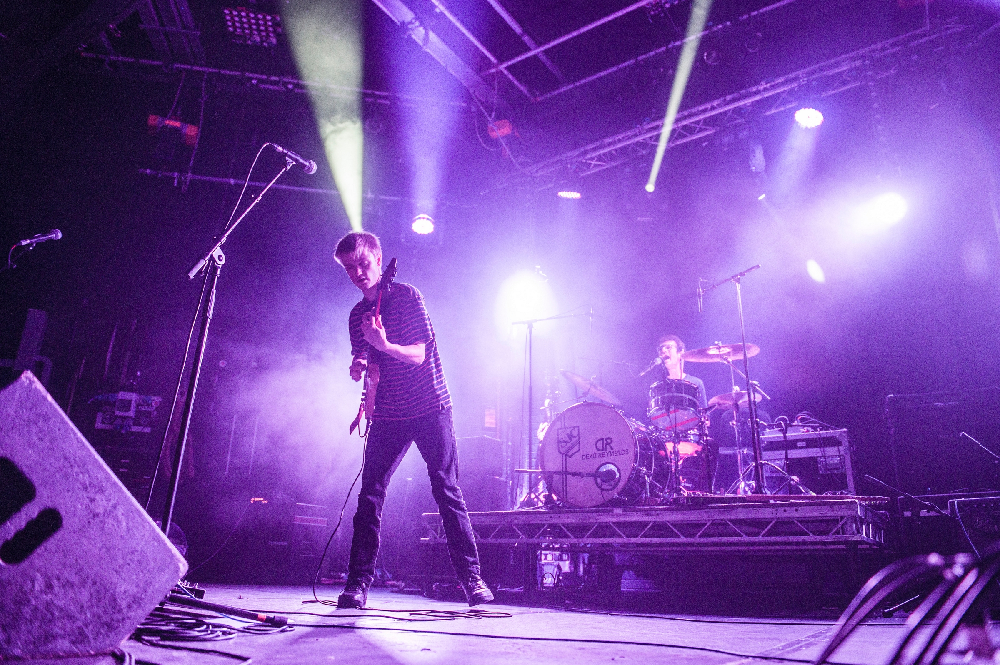
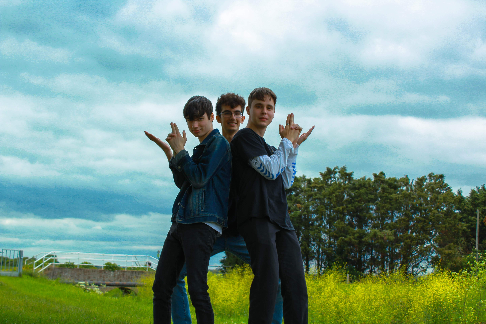

# Music
Outside of formal work and study, I'm a big music fan. I've been playing drums in bands for years and it's come to form an important part of my identity. So, in a vain attempt to beat the maths nerd allegations (double meaning intentional!), I thought I'd chuck in a few links on my personal site so showcase what I've been getting up to.
## Projects

| Band                                                                                    | Years Active |
| --------------------------------------------------------------------------------------- | ------------ |
| [Influx of Insanity](https://influxofinsanity.bandcamp.com/album/influx-the-collection) | 2016 - 2021  |
| [The Karma Violets](https://karmaviolets.bandcamp.com/music)                            | 2019 - 2021  |
| [Feed the Mammoth](https://feedthemammoth.bandcamp.com/)                                | 2021 - 2025  |
| [Balloon Tomb](https://www.instagram.com/balloon_tomb/)                                 | 2024 - 2026  |

## Some Background (if you care!)
### Influx of Insanity
It all started aged 14 with a noisy prog metal double-act called [Influx of Insanity](https://www.instagram.com/influxofinsanity/). We played a *lot* of gigs, wrote some hilarious, teenage angst-ridden lyrics and released some self-produced music out into the world. It was great fun! This [video](https://www.youtube.com/watch?v=Ot16iTOSIvc) gives you a good idea of what we were all about... 

My partner in crime [Dom Howard](https://linktr.ee/Dom.howard_) went on to study jazz at RCM after we finished in 2021 and he's utterly brilliant, go [check him out](https://domhoward.bandcamp.com/album/all-the-paths-join-up-here). 

  

    
  

### The Karma Violets
The Karma Violets came together thanks to complete chance! I met the lovely [Wes Ayres](https://www.instagram.com/wesley_ayres_music/) whilst working as a waiter at Peterhouse College, Cambridge, we got chatting music and decided to form a band. With the addition of the crazy mutual connection Ambrose de Soissons-Page (Wes' family friend who also happened to played the same [LMHR](https://www.lovemusichateracism.com/home/) / [REPEAT](https://www.repeatfanzine.co.uk/homepage.htm) gigs as me back in the day!), we completed this indie-rock trio. Lockdown couldn't stop us pumping out two EPs - have a listen [here](https://karmaviolets.bandcamp.com/). 

  

    
  

### Feed the Mammoth
I headed off to University in 2021 and threw myself straight into the smorgasbord of musical madness that is [Warwick BandSoc](https://www.instagram.com/warwickbandsoc/). I played in a wacky variety of bands - shoutout to the angry garage punk of [Domestic Love](https://youtu.be/Jl_S9tzjVro?si=uPLFTgpQNBGDDSsO&t=270) and my good friends in [Sunny Side Down](https://www.instagram.com/sunnysidedownband/)! Eventually, I decided to settle down and focus on Feed the Mammoth. We wrote some tunes I'm genuinely proud of and had a banging time doing it. If you want a flavour of what we got up to, check out our [YouTube](https://www.youtube.com/channel/UCl9l2k9-kfGDI2H8EHLcG9Q).

  

    
  

## Community Building
In my 3rd year, I had the privilege of serving as president of BandSoc. It was busy, intense year and one of the best decisions I've ever made. 

Alongside my fantastic exec team, I put on around 50 events during my term. Highlights included organising a week-long tour around the UK for 5 bands, instituting a free annual summer festival on campus and organising the massive annual Battle of the Bands competition. It was a blast!

But honestly? Seeing friendships form, those memories made? It was a deeply moving experience. University can be a lonely place, and in our world that so heavily incentivises the *individual* ('sort *yourself* out, increase *your own* following'), there are very few social structures that tie people together like that, forcing your to put your faith in others - in something bigger than yourself. 

This time I spent building a genuine sense of place-based community in BandSoc will stay with me forever. Yes, it's obvious, and I don't want to be too 'let's all hold hands and sing Kumbaya round the fire', but there is *real* power in building this sense of collective identify. It's something I want to keep chasing in everything I do. Thanks BandSoc ❤️

<!-- 

  

    
  

-->