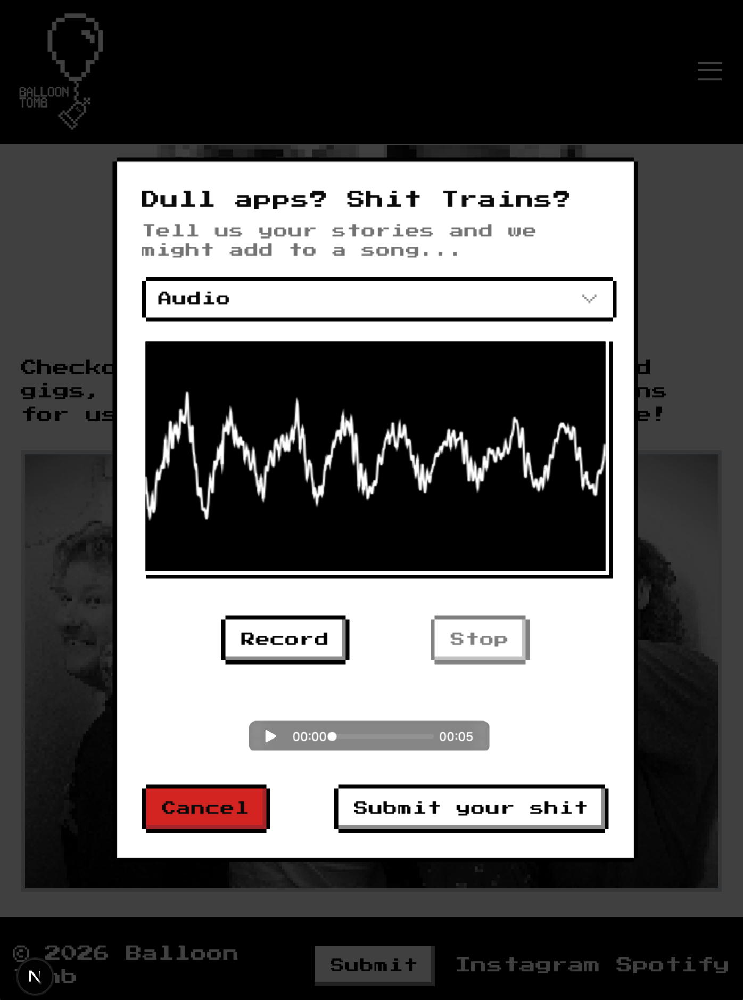

# Deploying a Next.js app on a VPS

## Intro

Currently, I’m learning how to build a modern mobile application which should be able to handle (hopefully!) many 1000s of users. And while I've been coding for a while, most of my scripts have been one-off experiments, implementations of an algorithm, or a demo UI that stayed on `localhost` — never leaving my laptop. 

So, if I want to build this app, I'll need to understand the modern infrastructure stack that enables a user to go on their phone, connect to some application, and speak to the database behind it. Hopefully, understanding this stack means I'll be able to finally *scale* any tech I build, so people can actually use it!

More granularly, this means understanding:

- **DNS**: The Domain Name System (how you tie your domain name to the IP address of your machine)
- **VPS**: you let your application run on Virtual Private Server — it's just some massive computer, cut it up into little piece (virtualisation) which you can then rent out and treat as your own machine. 
- **Reverse proxies**: routes HTTP traffic from the server IP address to the correct part of your application.
- **API requests**: how information be transferred over the internet via JSON payloads via HTTP.
- **Database Architecture**: how to setup and interact with your backend via SQL.
- The benefits of containerisation via **Docker**: allowing multiple devs to work on the same backend infrastructure despite different OS, plus enabling smoother deployment onto a VPS.
## Diagram Overview 


To learn these concepts, I needed a concrete goal...so, why not make a website for my band! We'll seem more pro or something...

*Diagram wrong - Cerbot is not a CA!*
## Building the frontend locally

Luckily, my band Balloon Tomb has a pretty particular aesthetic, so the design goal was simple: build a blocky retro/8-bit/early-2000s style website which let's people learn about our band, (in the future) buy merch, read our lyrics, find out about our shows and submit some stories / audio which could enter our songs...

So, I picked a modern frontend framework (Next.js + an 8-bit Shadcn extension) and using an LLM as a coach (no copy paste! understand every line!) I mocked up a 'good enough' frontend. 


At this point, I wanted to get some feedback from bandmates about the website design, so I deployed the site using `pm2` onto my VPS. 

This was great but a simple static site is pretty dull, so before getting into deployment, let's add some backend to our site... we can then learn about **containerisation** which will make spinning the application up on our VPS a breeze down the line. 
## Adding User Interactivity

To get some experience with handling user-submitted data, I created a text and audio submission form. It was pretty fun to learn about the [MediaStream Recording API](https://developer.mozilla.org/en-US/docs/Web/API/MediaStream_Recording_API). All the tools you need to manipulate audio in the web (recording, storage, even [FFTs](https://developer.mozilla.org/en-US/docs/Web/API/AnalyserNode) for manipulation and visualisation), all accessible via an open web standard. Neat. 



But where to store this data?
### Creating a database and API locally

I wanted to build up the complexity one level at a time. So, I started by simply creating a database on my local machine with [`psql`](https://www.postgresql.org/docs/current/). 

After installation, you can create a client to interact with `postgres` process via the command line. For [example](https://www.postgresql.org/docs/current/app-psql.html), 

1. `psql -U postgres` to login to Postgres as the user `postgres`
2. Create a server with `CREATE DATABASE <db-name>`.
3. Connect to a server via `\c <db-name>` 
4. Then, create an empty table in that database. For example, for my user's text submissions, you'd run the following SQL command

```sql
CREATE TABLE form_submissions (
  id SERIAL PRIMARY KEY,
  name TEXT NOT NULL,
  email TEXT NOT NULL,
  message TEXT NOT NULL,
  created_at TIMESTAMP DEFAULT NOW()
);
```

Then, you'd just need to hook up a button such that when a user presses, this triggers an API call which sends a `POST` request via HTTPs to our application's server. The server would then execute SQL to to insert the information into the database. 
### Limitations of configuring a `postgres` database manually

While this setup works, if we want to pickup our db and site from our local machine where we're developing and then plop it down inside our VPS, then this process would become frustrating. We'd have to write down exactly what tables we created inside our server and implement it manually. We'd like some kind of tool to programmatically setup the entire environment that our 'full-stack' application lives...
### Docker and containerisation

This is where Docker comes in. Instead of having to manually build our environment every-time we spin up our application, we can write down all of these details using docker-compose and then let Docker handle the process of building the environment in which our application lives. 

This has the great added benefit of being machine agnostic. If you specify the `docker-compose.yaml` file, then it doesn't matter if your local machine is a Mac, Windows, Linux..., it just spins up a linux-based process for each of your services, which all share the host's kernel. We can abstract away the specifics of the particular machine you're working on - amazing! 

This has been a key mental shift in the deployment of software in the last few years — shifting the server from being [machine oriented to application oriented]([this](https://queue.acm.org/detail.cfm?id=2898444)). Tools like *Terraform* soup-up this idea for major applications, allowing you specify your [infrastructure as code](https://developer.hashicorp.com/terraform/tutorials/aws-get-started/infrastructure-as-code).

So, for the Balloon Tomb site, we just need the following services, each running in their own container. 

1. The site itself, spun up and running on `localhost:3000`
2. The database for the site, spun up and running on port `5432`
3. (Optional) An instance of pgAdmin so that we can query the database in a nice GUI. 

We can go ahead an implement this by creating a file called `docker-compose.dev.yaml` in the root of the directory. The [official tutorials](https://docs.docker.com/get-started/workshop/02_our_app/) are excellent at explaining what is going on and how to get started. 

In development, here's a simplified version of my docker compose file for the app. In production, we need to be careful about what ports we expose to the web.

```yaml
services:
  app:
    container_name: balloon-tomb-site
    build:
      context: ./site
      dockerfile: Dockerfile.dev
    ports:
     - "3000:3000"
    volumes:
     - ./site:/app
     - /app/node_modules
     - ./audio:/app/audio
    env_file:
     - .env.local
```

This basically says, "create a container for the app, build it according to how I specify in my `Dockerfile`, let the app run on port 3000 and build these volumes inside the container where my data will be stored".

For the app, the `Dockerfile.dev` just specifies a clean environmental for local development.

```Dockerfile
FROM node:20-alpine

# Set working directory.
WORKDIR /app

# Install all the package dependices needed in the project (e.g. UI components)
COPY package.json package-lock.json ./

# RUN npm install to download all of those packages to the container
RUN npm ci

# Copy the source code
COPY . .

# Expose Next.js dev port
EXPOSE 3000

# Start next.js in dev mode
CMD ["npm", "run", "dev"]
```

We can then add a service to our `docker-compose.yaml`  to spin up a PostgreSQL database.

```yaml
services:
  db:
    container_name: balloon-tomb-db
    env_files:
     - .env.local
    image: postgres:16-alpine
    ports:
     - "5432:5432" # Don't do this in prod!!!!
    volumes:
     - postgres_data:/var/lib/postgresql/data
     - ./db-init:/docker-entrypoint-initdb.d
    restart: unless-stopped
```

Neatly, we can just clone the official Docker [image hosted online](https://hub.docker.com/_/postgres). The `.env.local` file contains all of our database connection information. 

```.env
# Database
POSTGRES_DB=balloon_tomb_db
POSTGRES_USER=admin_user
POSTGRES_PASSWORD=something_very_secure
DATABASE_URL=postgresql://admin_user:something_very_secure@db:5432/balloon_tomb_db

# site
NODE_ENV=development
NEXT_PUBLIC_API_URL=http://localhost:3000
```

We also spin up all of the tables programmatically via a folder at the project root called `db-init`, which has some SQL queries to initially create the tables we want. 

### Spinning up our container

Now that we're defined the infrastructure we want our application to run on, we can just spin it up via

```
docker compose up
```

We can then inspect all of the containers inside of our compose stack

```
docker compose ps
```

You can even move into the terminal of the linux machine you've spun up. The flag `-it` means 'interactive terminal'.

```
sudo docker exec -it <container name> <shell command>
```

## Deploying to a VPS

With this basic website functioning locally, we now want to deploy this to the web. This'll show us how you take a project from being a fun local demo to being deployed on an actual server in the big bad world. There's 5 key steps (modified from [this](https://gist.github.com/hp0098v1/68de312b4dce4f38a9d121873ece6b53) article by [Erfan Paya](https://github.com/hp0098v1)):
### 0. Prerequisites

We had the website working locally, so I went onto the internet and rented out...

1. **A Virtual Private Server**

This is a physical computer, living in some data centre, somewhere in the actual real world. Choices for large scale infrastructure (major banks / social media platforms) would be AWS or GCP. But for smaller indie developers, there's *loads* of options to pick from (e.g. DigitalOcean, Linode, ...). You just need to balance your requirements and costs. 

The VPS will allocate you a IPv4 address. This is the 4th version of the internet protocol that controls routing internet traffic. It's just a 32-bits number, often expressed as four 8-bit hexadecimal values `x.x.x.x` written in [dot-decimal notation](https://en.wikipedia.org/wiki/Dot-decimal_notation). This value is unique across the entire internet, but with only $2^{32}\approx$ 4.2bn addresses, IPv6 is set to replace it in the long-term. 

2. **A Domain Name**

Once you buy your domain name from [any retailer](https://www.top10-websitehosting.co.uk/best-domain-registrars/) (e.g. Porkbun, GoDaddy, Namecheap, ...), you can then manage the DNS (domain name system) records for your domain. So, if the host domain was www.example.com then the provider then routes traffic to the particular IP address you configure - exactly the IP address of your newly created VPS. 

The DNS record is basically a switchboard, connecting traffic that visits your domain, and securely routing to your server. 

```sh
A   @     your.vps.ip
A   www   your.vps.ip
```

It can take a few minutes for this record to propagate once you change the configuration.
### 1. Preparing the VPS

We've rented this VPS, but how do we connect and use it? 

The internet is a magical thing — we can create a secure shell connection to our remote computer and then simply ssh into the machine to start running terminal commands inside it! After providing a locally generated [ssh key to your VPS provider](https://docs.digitalocean.com/products/droplets/how-to/add-ssh-keys/), you can then run 

```
ssh root@<ip.address.of.machine>
```

You're now inside! 

#### Updating the system

Because this is your own machine, you're responsible for updating and managing the machine yourself. So let's get the latest package list. `sudo` stands for 'superuser do', and let's the Linux OS execute commands with full permissions. `apt` is the advanced package tool, used for package management on [Debian](https://en.wikipedia.org/wiki/Debian)-based Linux.  

```sh
sudo apt update && sudo apt upgrade -y
```

We'll install git, `cd` into a sensible folder and then clone the repo.

## 2. Clone the project

```sh
sudo apt install git curl -y
cd <somewhere you like in your machine>
git clone https://github.com/your-username/your-repo.git
cd your-repo
```

We now want to spin up this application with Docker, so will install it as follows

```sh
sudo apt install docker.io docker-compose
```

And verify the installation

```sh
docker --version docker-compose --version
```

## 3. Building the stack

You can then build the compose stack we've defined. This pulls all the relevant packages from the web, creating the environment you've specified in your `docker-compose.yaml`. 

```
docker compose build
```

For production, we need to make a few changes to the compose stack. Namely having a `next build` process which [optimises the site build](https://nextjs.org/docs/app/guides/local-development) for the web and only exposing the database to our internal server, not the public web. In the `.env.prod`, there's a line like below to set this up. 

```
DATABASE_URL=postgresql://username:password@db:5432/dbname
```

Now the environment is built, you can spin it up! The `-d` flag means detach, so these processes run in the background. 

```sh
docker compose up -d
```

## 4. Setting up nginx as a reverse proxy

### Install `nginx`

'Engine-x' ([nginx](https://nginx.org/en/docs/beginners_guide.html)) is used here as a web server and [reverse-proxy](https://en.wikipedia.org/wiki/Reverse_proxy). It receives requests that have been routed to the IP address of our server and then forwards them on to the correct port running internally.

```bash
sudo apt install nginx -y
```

In the image below, the internet cannot tell the difference between the web server and the reverse proxy:


### Defining the `nginx` configuration

Inside our terminal, we need to create a file which defines our configuration on our VPS. 

```sh
sudo nano /etc/nginx/sites-available/yourdomain.com
```

Warning! This command creates a new file with a [vim editor](https://vim.rtorr.com). This can feel counter-intuitive to type in. 

Then, paste in a file like this. The code below basically says, "when traffic lands at this IP address, look at what domain name it's requested from the HTTP metadata and then forward the request on to the correct internal port of the VPS".

```nginx
server {
    listen 80;
    server_name yourdomain.com www.yourdomain.com;

    location / {
        proxy_pass http://localhost:3000;
        proxy_http_version 1.1;
        proxy_set_header Host $host;
        proxy_set_header X-Real-IP $remote_addr;
        proxy_set_header X-Forwarded-For $proxy_add_x_forwarded_for;
        proxy_set_header X-Forwarded-Proto $scheme;
    }
}
```

The app we've built has no idea about HTTPS or privileges. It's nginx which is handling certificates and TLS (transport layer security) for us. 
### Enabling nginx

```sh
sudo ln -s /etc/nginx/sites-available/yourdomain.com /etc/nginx/sites-enabled/
sudo nginx -t
sudo systemctl reload nginx
```

`nginx`  should now be routing traffic from our IP address to the port on our VPS where we've exposed our site. We're live!

## 5. Enabling HTTPS with Let's Encrypt

You don't want to look like a scam website... We need a secure HTTP connection. Thankfully, the Electronic Frontier Foundation has an open source tool called `certbot` which can handle this for us. 

[Certbot](https://certbot.eff.org) proves that our webserver actually controls this domain name. The [Let's Encrypt](https://letsencrypt.org/how-it-works/) Certificate authority looks at the domain name being requested and issues some challenges. If our cerbot succeeds, then it's allowed to handle certificate management for our domain name.  
### Install Certbot

```bash
sudo apt install certbot python3-certbot-nginx -y
```

### Obtain SSL Certificate

This proves that I own the domain and issues TLS certs. 

```bash
sudo certbot --nginx -d yourdomain.com -d www.yourdomain.com
```

The site should now be available at `https://example.com`! 

## Wrapping up

Here, we've successfully deployed a simple full-stack Next.js app on a VPS and exposed it to the world wide web. Check it out here: www.balloontomb.band. On the road, we've learnt several concepts which are vital to the proper development and deployment of modern web applications. See the full repo [here](https://github.com/oliverkiranbrown/balloon-tomb-website/tree/main). This mini-project has given me the confidence to tackle some more hefty projects in the near future... 