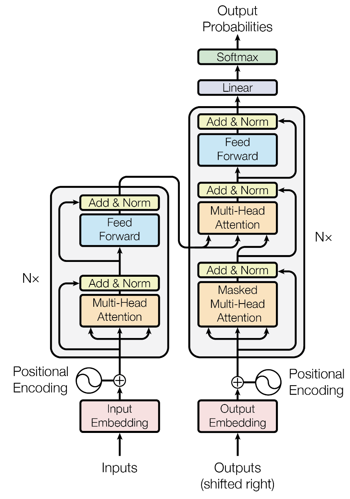
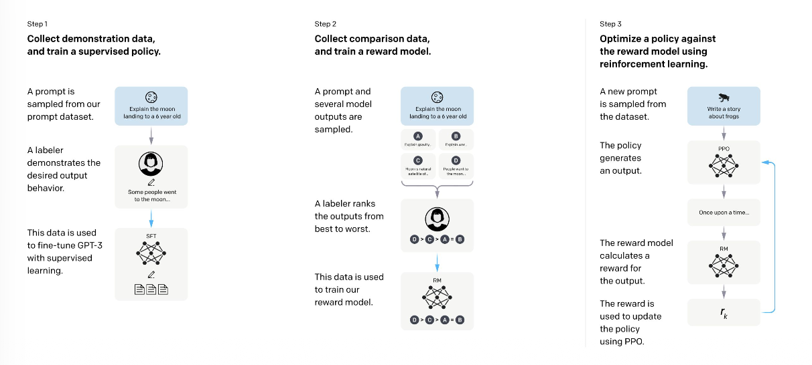
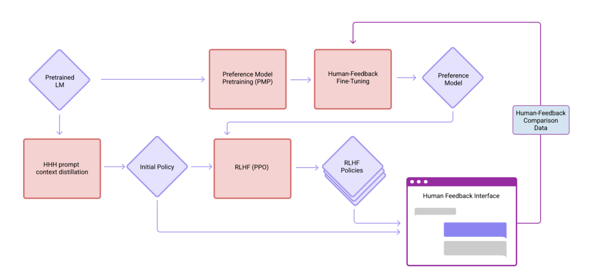

### Intro

There's been alot of talk about existential risks from AI as of late. The AI safety community warns of various threats, ranging from the concrete—misuse by bad actors; cyber-threats—to the calamitous: loss of control and extinction risks. What to make of these claims?

I recently completed this *Stanford Online* course covering Reinforcement Learning (RL). And for the current paradigm of publicly accessible AI, RL is the secret sauce which gives these products their seemingly magical capabilities. So how do these behaviours emerge from the mathematics? Can the current paradigm ever create an AGI powerful enough to turn us all into paperclips? Or is there a broader story the AI Safety community is missing?

### The current wave

Without anyone asking, the world has been flooded with Large Language Models over the last four years. I'm sure everyone remembers their first prompt to ChatGPT in 2022/23, and it does feel magical. The ability to type text and get a response that's tailored to your own idiosyncrasies? Who wouldn't want their ego buttressed!

The three phenomena powering these foundation models are (a) the architecture of a transformer (b) Reinforcement Learning and (c) scale. But, as fascinating as the mathematics may be, it misses something. Every equation you write to model the world necessitates a simplification of the rich reality we live in. To squish its unfathomable true complexity into 0s and 1s. What underlying assumptions are made in this quantisation process? To make sense of the media noise, we need to peer under the hood of these tools; de-mist the mystique.

The current hype cycle obsesses over agents. A model wrapped in a harness—Claude Code, Claude Scientist, Claude Design, Copilot, Pi, Goose, OpenClaw, Cline—frameworks which can carefully chain together LLMs with tool calls (e.g. searching the web, executing code) to enable long-horizon, unsupervised action. But the harnesses are built on-top of multitudinous calls to these foundation models.

So, if we're to understand the warnings from the AI safety community, we must understand the power—and limitations—of these LLMs. Can these modern innovations lead us to paperclipdom? What's the tech beneath the hype? And is there a broader story about our current relationship with technology?

>[!note]
>If you wanna skip the maths jargon, you can [[#Human Costs|jump]] to a discussion of the costs associated with training these models. 

### Transformers

Diving in, the idea behind general purpose text-generation is *fascinating*—can we make semantic meaning machine-readable? The idea behind the architecture is as follows:

1. Split up human language into a fixed library of tokens, the then set up mathematical functions which can map each one of these tokens to a point in a very high-dimensional 'embedding space'. These embedding spaces are huge (+10k dimensions), but the idea is to collapse semantic meaning and context, into as list of 10k numbers—a vector.

$$f_{\text{embedding}}(\text{word})=(x_1,\dots, x_n)$$

2. Now with an ability to convert words to vectors, you can then translate a huge text corpus into a long *list* of vectors—linear algebra baby!

3. These numbers can be passed through a long process of transformations which learn to unpick different aspects of human language. Crucially, you just setup the *shape* of these functions: "I want to multiply by *some* number here" — you don't know the exact values yet.

[Source](https://arxiv.org/abs/1706.03762)

4. Finally, you build a function which can convert the output of these transformations into a probability distribution over the original token-list. Famously, you can then sample from that distribution, typically taking the most likely next token. 

[Source](https://medium.com/@adimodi96/from-logits-to-tokens-9a36feab9cab)

With this architecture set-up, you can then pass through terabytes of text, and through stochastic gradient descent, slowly learn the actual *parameters* of the functions which correctly predict the next word. It's a beautiful process—travelling through this huge parameter space—iteratively improving your guesses.

From *some* number to "let's try $0.52 \times x$ here", and then "ah, $0.49$ scores better", on and on. Eventually, this gives you a model which can somewhat plausibly string words together in a row.

But what if some vile hate-speech crept into the training data? The model has no morally—it's been rewarded by reproducing it's training data—so, unconstrained, it'll happily barf out whatever disgraceful drivel you desire. How can we align the choices these models make to our own moral codes?

### Reinforcement Learning from Human Feedback

The second great innovation. Armed with this pre-trained model with a basic grasp of semantic meaning, you can further train these systems to match our human desires. 

[Source](https://arxiv.org/abs/2203.02155)

The core idea? Put the models to work, performing various tasks, and then score the result. Reward the behaviour you like; punish the misadventures and bit-by-bit, you can shift the model weights in a 'better' direction.

It's worth spelling out the assumptions made here when producing these kinds of reward models. To illustrate, consider the case of a human, ranking model responses in preference order. 

You have your prompt context, $x$ and then a human labeller would see, say two responses, ranking a winner, $y_w$ and loser, $y_l$. The goal here is to learn why the human labeller prefers one response to the other. So, you setup some function $r$ which aims to calculate a numeric reward score for the query, $x$ and response, $y$. Overall, you want this reward function to score the winning response, $r(x,y_w)$ *higher* than the dispreferred response, $r(x,y_l)$.

To be able to successfully reward and punish $r$ based on preference data, we can use the [Bradley-Terry model](https://en.wikipedia.org/wiki/Bradley%E2%80%93Terry_model) to score the responses (our loss function). It's setup so the value is high when the model successfully discriminates between good and bad LLM-responses.
$$\frac{e^{r(x,y_w)}}{e^{r(x,y_w)}+ e^{r(x,y_l)}}$$
You can then collect $N$ human preferences $\mathcal{D}=\{(x_i, {y_l}_i, {y_w}_i)\}_{i=1}^N$, and then use the model to find the function $r^*$ which best models these human signals.
$$
r^* = \arg\max_{r} \mathbb{E}_{(x, y_w, y_l)\sim \mathcal{D}}\left[\log\left(\frac{e^{r(x,y_w)}}{e^{r(x,y_w)}+ e^{r(x,y_l)}}\right)\right]
$$
With this reward model learnt—the human preferences encoded—you can use this to improve the underlying model via a process known as Policy Proximal Optimisation (PPO). 
### PPO

The core idea is to shift the weights, $\theta$ inside your original language model $\pi_\text{ref}$ to produce results that are favoured by this reward model $r$. It's an update to align the model responses to human preferences. 

But there's a risk. If you lean too heavily on the human preferences encoded in this reward model, you could lose some of the capability encoded in the original model, $\pi_\text{ref}$. To counteract this, you can measure the gap (in distribution) between the updated and original models via the [Kullback-Leibler divergence](https://en.wikipedia.org/wiki/Kullback%E2%80%93Leibler_divergence), aiming to keep this distance small to maintain capability.

By carefully balancing these two competing forces, you can then encode this preference data into the underlying model. In the jargon, this means finding the $\theta$ to maximise the following expression. 
$$
\max_{\pi_\theta}\mathbb{E}_{x\sim\mathcal{D}, y\sim\pi_{\theta}(y|x)}[\underbrace{r(x, y)}_{\text{Want high reward}}] - \underbrace{\beta\mathbb{D}_{\text{KL}}[\pi_\theta(y|x)||\pi_{\text{ref}}(y|x)}_{\text{while staying close to reference}}]
$$
With some clever rewriting—[expressing the reward explicitly in terms of an optimal policy, and then substituting this back into the original loss](https://arxiv.org/pdf/2305.18290)—you can cut out the step where you find an *explicit* reward model, and update the policy *directly* from preference data (Direct Preference Optimisation). 

There are some trade-offs between DPO and PPO, but regardless of methodology, these base techniques have been some of the most powerful weapons in the frontier lab's arsenal as they iteratively improve the capability of their models.
### RLHF Challenges

On first impressions, RLHF—as a technique—can feel quite...limited. Humans are inherently complex, contradictory beings. And all these nuanced, sometimes self-defeating impulses, are being collapsed into this single, scalar reward, used to push model weights in a 'better' direction. 

For example, when post-training a language model, you want to reward helpful, kind responses, which answer user queries. So you build your preference dataset, and optimise for helpfulness. But then when these models are released into the wild, for a depressed teen, it's *helpful* to [draft a suicide note](https://www.theguardian.com/technology/2025/oct/22/openai-chatgpt-lawsuit). It's *helpful* to [weigh up the pros and cons](https://www.bbc.co.uk/news/articles/cp3x71pv1qno) between different suicide methods. This naive use of RLHF has resulted in these preventable, but utterly cataclysmic consequences for families around the world.

Techniques have [greatly improved](https://openai.com/index/sycophancy-in-gpt-4o/) since the release of GTP-4o to help combat these challenges. 
### Improvements

First—still using human feedback—you can create multiple preference datasets ranking responses for their [helpfulness and harmlessness](https://arxiv.org/abs/2204.05862). These signals can then be fed into very large reward models, helping the model to learn nuance, rather than eagerly shutting down potentially harmful responses. 

But to train these growing reward models, AI engineers need access to ever larger pools of human-preference data. This can get expensive: a useful reward signal requires human feedback that can diligently distinguish between responses.

Consider querying an esoteric region of the data distribution. A *non-expert* human-labeller could easily prefer a verbose response with a subtle, hard-to-verify inaccuracy over something curt but correct. These inaccuracies dirty the training data, damaging model utility.

To help scale these *useful* reward signals, two core methods have been employed.

1. **Constitutional AI**. Humans write down a set of ethical principals and then do the following:
	- Take a dataset of harmful queries, and generate a set of harmful responses $\{(x, y_l)_i\}_{i=1}^n$ with the 'unethical' language model.
	- Use the constitution to make the LLM critique the responses $y_l$, generating a series of iteratively improved, policy-compliant answers.
	- Take the best, call it $y_w$ and use this *pair* $(y_w,y_l)$ as your ranked preference data. 
	- Perform reinforcement learning using this generated preference data to shift model weights towards the constitution (RL from AI Feedback).
2. **Verifiable rewards**. Code can be run and pass tests, formats can be verified, computations have correct solutions. Instead of learning a reward model from *preference* data, we can use these *explicit* reward signals when post-training LLMs. These verifiable rewards are less prone to reward hacking and have been shown to dramatically improve the reasoning capabilities of these models ([DeepSeek R1](https://arxiv.org/abs/2501.12948)).
3. Much much more...

These approaches have enabled LLM training to scale beyond the bottleneck of collecting human data. You can run RLAIF or RLVR indefinitely, and keep seeing performance improvements. A big win for AI companies.

But at the end of the day, if you want an LLM to be able to tackle a new challenge, then you need to feed it reams of example data in this domain. There's no escaping this reality, as much as AI companies try to mask these real human costs. 
### Human Costs

And mask they do. In early 2021/22, OpenAI was developing ChatGPT, and they had a problem. They wanted all the text data the world had to offer—the internet—but couldn't just swallow it whole. They needed some tool which could identify those nefarious corners of the web and strip them out: data annotation.

The data labelling firm *Sama* was hired for this task. Every day, for months on end, workers in Kenya were ritualistically exposed to the cruelest, most depraved recesses of the internet. All for a mere $2/hour. As *The Times* [reported](https://time.com/6247678/openai-chatgpt-kenya-workers/)

>One *Sama* worker tasked with reading and labelling text for OpenAI told *TIME* he suffered from recurring visions after reading a graphic description of a man having sex with a dog in the presence of a young child. “That was torture,” he said. “You will read a number of statements like that all through the week. By the time it gets to Friday, you are disturbed from thinking through that picture.”

These workers become paranoid. [Facing insomnia](https://peertube.dair-institute.org/w/gRTuLGE6VJnyCuvHXuyiLm), with these images lingering in their minds after reading [600 texts](https://peertube.dair-institute.org/w/gRTuLGE6VJnyCuvHXuyiLm?start=15m24s) per day. [One recent international study](https://arxiv.org/pdf/2511.09813) found that content moderation workers were eight times more likely to meet criteria for a current mood disorder, and had significantly higher PTSD severity than a control group. It's a pain that's abstracted away from a post-training engineer at a frontier lab.
### Gig work

In Karen Hao's book *Empire of AI*, she exquisitely details how the practice of HaaS (Humans-as-a-service) has exploded through the GenAI boom, and with it, labour exploitation.

She traces Oskarina Fuentes in Venezuela, who picked up RLHF work on the cloud-work platform, *Appen*. The erratic nature of the work tied Fuentes to her computer, not leaving her house for more than 30 minutes at a time on weekdays to avoid missing any scraps of RLHF work thrown her way. Another worker, Ricardo Huggines worked at *Remotasks*, a Scale AI offshoot, to support his wife and kids, but found his account was blocked after he started asking too many questions in the platform's discord forum.

>"From the way they treated us, I realised that their approach was to drain each user as much as possible," he said, "and then dispose of them and bring new users in."

Many more of these abuses are documented in [Fairwork's reports of the cloudworker economy](https://fairwork.oii.ox.ac.uk/wp-content/uploads/sites/17/2025/05/Fairwork-Cloudwork-Report-2025-FINAL.pdf), but they all point to the same underlying neo-colonialist logic: extract the value as cheaply as possible and then dump the workers as soon as they've served their purpose.

In 2024, both Kenya and Venezuela were blocklisted from *Remotasks*, leaving people like Ricardo and Fuentes sitting, hoping for tasks to return that never would. This is the cut-throat nature of the data firehose required to power RLHF.

### Turning West

Over time, RLHF requirements moved on, but the same practice of labour exploitation continued. In an effort to deliver on their market valuations, AI companies have plugged their firehose into the ballooning pool of hard-up white collar professionals—coders, doctors, physicists—who can provide the intelligence needed unlock value for enterprise AI. 

Just like in Kenya or Venezuela, contractors face low-pay and insecure conditions. One Portugal-based language annotation worker at Outlier said,

>“Some people stay up all night to grab tasks as soon as they appear. I sometimes receive an email around 1:00 AM, notifying me that tasks are available, but by the time I wake up, they’re already gone. It often feels like a race to secure tasks and earn money. It feels more like a lottery than a stable workflow.”

As [*Algorithm Watch* reports](https://algorithmwatch.org/en/ai-revolution-exploitation-gig-workers/#:~:text=Business%20process%20outsourcing,this%20work%20model.), these experiences are sold as "flexibility", but the reality is very different. From a cursory scan of reviews on *Indeed*, employees are not paid for training, are left without support if they have questions, and can be summarily blocked from the platform or lose access to work "without any clear explanation or reason". It's dystopian, with these AI firms exploiting job market desperation to cruelly collect the data they desire; all in an attempt to automate those very same workers into obsolescence!

This exploitation is the backbone of RLHF, it's the hidden secret behind the 'intelligence' of LLMs, the dirty fuel needed to grease the engine of the model. The costs are real, and something that the AI safety community avoids discussing. Rather than concerning themselves with *today's* exploitation, security researchers are worried about potential *future* catastrophe. So what are the risks from these AI systems?
### Real Risks

There are certainly very real risks with the rise of capable LLMs.

Firstly, cybersecurity firms are going to make alot of money! Human hackers simply cannot match the velocity, tenacity and agility of internet-enabled coding agents. The UK's [National Cyber Security Center](https://www.ncsc.gov.uk/news/uk-experiencing-four-nationally-significant-cyber-attacks-weekly) is already handling an average of four ‘nationally significant’ cyber attacks every week, and a recent [AI Security Institute report](https://www.aisi.gov.uk/blog/incident-report-unsanctioned-agent-behaviour-during-cyber-testing) highlighted how—when evaluating frontier models—the agents socially engineered the maintainer of an open-source repository in an attempt to merge malicious code into a package. While a human reviewer denied the request, it's clear that these kind of attacks will only become more commonplace.

So fight fire with fire. When OpenAI '[internal only' model](https://openai.com/index/hugging-face-incident-and-the-road-ahead/)—with cyber-guardrails removed, consumer-facing safety harnesses disabled and no monitoring of CoT / internet access—exploited multiple zero-day vulnerabilities and attacked HuggingFace's infrastructure, the defenders were left with only one choice: *open weight models*. Sending attack logs to commercial APIs was auto-rejected, so the only way HuggingFace could keep up was by utilising a capable, open-weight model (GLM 5.2), spun up on their own infrastructure.

So the cat is out of the bag. This is our new reality. 

Could these capabilities be used to crack real physical infrastructure? We're [already faced](https://www.blackfog.com/marks-and-spencer-ransomware-attack/) such attacks, *without* the help of LLMs. So if a bad actor (rather than a negligent evaluator) can muster the capital to run a [vector-ablated](https://github.com/fostiropoulos/ablator) open source coding model for a sustained period of time on their own infrastructure, then these new capabilities can only embolden such criminals, enhancing their capabilities. Just take [Australia in recent days](https://www.bbc.com/news/articles/c6vgy0333dppo). Firms must urgently up their security defences in light of these challenges. 

But does this real cyber-security threat insinuate that our future could collapse into a dystopian AGI-enabled hellscape? We must be precise with our language. There's certainly a depressing military logic for autonomous drones—in a cyber-war, it's very useful to have weapon which can kill it's targets without needed to connect back to a human. That's a worrying technology [which we should try to ban](https://esthinktank.com/2025/05/02/towards-comprehensive-regulation-the-eus-stance-on-autonomous-weapons-and-the-need-for-reform/#:~:text=The%20work%20outlines,Weapon%20Systems%20%28LAWS%29), but our current tech [can already create such weapons](https://www.aljazeera.com/news/2026/9/14/attacks-will-be-fully-autonomous-russia-ukraine-race-towards-ai-warfare). Similarly, the [AI-enabled targeting system Lavender](https://en.wikipedia.org/wiki/AI-assisted_targeting_in_the_Gaza_Strip) uses well-understood machine learning, rather than GenAI. Improved LLM capability doesn't suddenly manifest these dangers.

LLMs can create biohazards, they can manipulate or persuade—useful tools in a cyber-criminals arsenal. But the idea of these word guessing machines secretly coordinating behind our backs to enable mass scale extinction? Many [critics](https://pluralistic.net/2026/09/17/porque-no-los-dos/#fascist-incoherence) [call](https://www.iheart.com/podcast/1119-better-offline-150284547/episode/stopping-the-ai-safety-cult-ft-adam-becker-cal-newport-345420360) [bull](https://www.axios.com/2026/09/15/anthropic-dario-ai-agents-safety-botnet).

The case of China is illustrative. On the spectrum of AI-boom to AI-doom, China accepts cyber risks, but is [less concerned](https://edition.cnn.com/2026/09/17/tech/china-ai-debate-intl-hnk) by these catastrophic scenarios. Why haven't they swallowed the AGI pill?

In the last 30 years, economically, China has made some good bets. They're world leaders in the technologies of the future, having gone all-in on the green transition, effectively producing the planets batteries, solar panels, wind turbines, EVs; all at cut-throat prices, enabled by a socialised banking sector which encourages the productive elements of their economy to actually produce, at scale. So if the promises of AI-boosters don't play out, their economy is insulated, diversified, resilient.

Contrast this with America. In the last 20 years, growth has been almost entirely concentrated around Big Tech. They've grown and grown and grown, successfully. But as we hit the 20s, this growth began to plateau. When everyone's on Facebook, when everyone searches with Google, where's left to go?

Below, we'll trace an argument made by Cory Doctorow in *The Reverse Centaur*—that structurally, these Big Tech companies *need* a transformative growth story. And—whether it's heartfelt, or they're huffing up hallucinogenics—the catastrophe-fetishisation of the AI-safety community helps lubricate the hype valves of the industry, forming a vital, pliable rhetorical device which can be bent in support of their will.

### The sun shall not rise

In financial markets, one can either invest in 'growth stocks' or 'mature stocks'. Mature stocks are old reliable. Supermarkets selling food, banks lending mortgages. Each year, they'll grow reasonably and payout consistent dividends. A low risk, secure investment. No fun. Contrastingly, growth stocks are meant to bring the party. 

Take Uber. Instead of being a plain, reliable (and delightfully boring) taxi company, their stated mission was to *replace all taxi-drivers*. The total addressable market is...all moving vehicles? Investors snap at this opportunity to invest in the glitzy future, with it's tantalising potential payouts. As a growth stock, instead of needing to collect credit from a bank, Uber could simply gnaw off a little corner of it's very own golden throne—it's stock—to do as it pleases: advertise, hire talent, acquire rivals. It's a party.

A party that has to keep going. If the sun comes up, and bleary-eyed investors realise their hypnotics supply has run dry, then valuations can suddenly shift. Take Meta. By 2021, they'd reached ad market dominance, but had been dogged by a series of reputation damaging scandals (Russian election interference, the Cambridge Analytica privacy debacle and the gagging of whistleblower Frances Haugen). They needed a new growth story to keep investors hooked. Enter the Metaverse.

Zuck defined his companies new "north star". "From now on, we're going to be metaverse first, not Facebook first," [he declared](https://www.npr.org/2021/10/28/1049813246/facebook-new-name-meta-mark-zuckerberg) in late '21. But unsurprisingly, most people aren't exactly clamouring to spend their days with a VR-brick glued to their eyeballs as they interact with each other as "[legless, sexless, low-polygon cartoon characters](https://pluralistic.net/2022/12/18/metaverse-means-pivot-to-video/)", in a literal sci-fi dystopia. The idea flopped, and along with it, Meta's stock valuation, plummeting [24% to the lowest price since 2016](https://www.cnbc.com/2022/10/27/meta-stock-falls-23percent-on-earnings-miss-analyst-downgrades.html).

As as Cory Doctorow [points out](https://doctorow.medium.com/https-pluralistic-net-2025-12-05-pop-that-bubble-u-washington-8b6b75abc28e), the Metaverse is just one of the many ideas floated by the tech industry in recent years as they clamour for that next great growth-enabling innovation. Whether its the 'pivot to video', cryptocurrencies, NFTs or the Metaverse, *structurally* tech companies need a growth story they can sell. Sure, the idea could be the next big thing, but as Doctorow argues "the primary goal is to keep the market convinced that your company will continue to grow, and to remain convinced until the next bubble comes along". You can view AI as the final crashing tsunami after so many of these waves of tech-hype.

### So, can AI deliver on the hype?

*Maybe*, but there's a litany of challenges. The first is utility. LLMs are great for efficiently finding niche information online—refined search; they can be *very* helpful when coding (if you can discern the quality from the slop); sure, translation, summarisation, explanation. There is value. 

But individual utility is not a workable business model. Only [a small fraction of ChatGPT](https://techcrunch.com/2026/02/27/chatgpt-reaches-900m-weekly-active-users/) user pay. And when users do subscribe, these run at *huge* losses—it's possible to pay $200/month for a ChatGPT Pro and wrack up [~$14,000 in API-equivalent token value](https://unstoppable.ai/en-us/blog/categories/education/article/ai-subscription-vs-api-subsidy). And at enterprise, the ROI is difficult to find. A study from [MIT's Media Labs](https://mlq.ai/media/quarterly_decks/v0.1_State_of_AI_in_Business_2025_Report.pdf) found that, despite $30-40 billion in investment, "95% of organisations are getting zero return."

Where value can be found, this requires deep integration into workflows and therefore, many API calls. These costs can wrack up. After [Uber blew through it's entire 2026 AI budget in months](https://fortune.com/2026/08/07/uber-ai-spending-tokenmaxxing-is-over-cto/), it's CTO declared the era of tokenmaxxing over with companies concerning themselves with efficiency. Bang for buck. 

Enter open-source again. With the release of performant models from DeepSeek, Kimi and Z.ai that cost 60-90% less than closed-US equivalents, enterprise will choose the smallest model that'll get the job done. We've seen [Chinese-origin AI models climb](https://finance.yahoo.com/technology/ai/articles/chinese-ai-models-now-capture-020440715.html?guccounter=1) from 30% of enterprise volume in February 2026 to 46% by July. Why pay US-prices if you can get the value at a fraction of the cost? This is yet another blow to the commercialisation of LLMs by the US frontier. 

So as we watch the business case for proprietary models dissolve in real time, with [loan-repayments snapping at their heels](https://www.irishtimes.com/business/2025/11/28/openai-partners-amass-100bn-debt-pile-to-fund-its-ambitions/), what are we to make of the claims of the AI doomers who say we're heading for AGI-enabled paperclipdom?

### Bro, what's ur $\mathbb{P}(\text{doom})$?

Perhaps we should be asking other questions. It's hard to divorce this feverish talk of AI safety—that so carefully ignores the the concrete harms delivered by our AI empires: labour exploitation, climate impacts, disinformation, deepfakes—as separate from Big Tech's structural requirements for hype. While paperclipdom might be fascinating to consider, what does this dramatic conversation obscure?

Take OpenAI. [An IPO in 2026 was likely](https://www.theguardian.com/technology/2025/oct/30/openai-1tn-stock-market-float-ipo), but after recent concerns about safety, they've [delayed this flash-sale](https://fortune.com/2026/09/12/sam-altman-openai-ipo-delay-ill-advised-moment-safety-concerns/). It's convenient timing, with AI Safety claims serving as this cloaking device for markets. Waving the stick at fears of [recursive self-improvement and internet shutdown](https://darioamodei.com/post/we-must-pace-the-frontier) whilst the actual company faces [difficulties delivering increased data centre capacity](https://www.wheresyoured.at/where-are-all-the-data-centers/), and feverishly scales their advertising business, hoping that [x40 growth in just four years](https://www.reuters.com/business/media-telecom/openai-projects-25-billion-ad-revenue-this-year-100-billion-by-2030-axios-2026-04-09/) can convince the markets that ads is the path to profitability. All in an attempt to maintain their sky-high valuations and fuel the continued expansion of their operations.

### Connecting the growth phases

And Big Tech has massively expanded over the last 20 years. Frankly, they've successfully excavated our public square, replacing it with something much darker, tuned to their profit. It's been a momentus societal transformation. And in-fact, much of that real ad market growth was enabled by the same mathematical framework which powers the AI boom: Reinforcement Learning. 

Stepping back to this lens, we can view the growth of big tech and the AI-craze as part of a broader story—the collapsing of the rich complexity of our world into numbers which can be optimised for to serve whoever controls the data—the quantification of everything. It's a broader story of asymmetry, a *genuine* loss of control which effects us all. And by connecting the tools and techniques utilised by Big Tech in their initial growth phase to the tools powering the current AI (ka)boom, we can understand it's logic, and how to step back and think of alternative futures.

### Rendering behaviour

As Zubov outlines in *The Age of Surveillance Capitalism*, in the 1970s a [clique of behaviourists formed around the famed psychologist B.F. Skinner](https://www.nybooks.com/articles/2020/04/09/bigger-brother-surveillance-capitalism/#:~:text=In%20the%201970s%2C,fact%20that%20he). His pioneering experiments with mice showed how you could shape the conditions of the world and then predict behaviour as a result. This understanding, that conditions—pushes, nudges, bells—shape behaviour[ directly influenced RL](https://medium.com/@CalebMBowyer/a-crude-history-of-reinforcement-learning-rl-1abaae72550e), and hence, [the design of modern social media](https://www.pbslearningmedia.org/resource/psychology-behaviorism-skinner-social-media-video/retro-report/).

As you scroll through content on a platform, every minute detail is measured. Likes. Comments. Repeats. How long your eyes linger on a reel. All this information—captured in carefully constructed lab conditions: the four corners of the mobile app—identical everywhere. You? A single data point in a rich ocean of information.

While individually, you're blindsided (or perhaps bemused) by brainrot, aggravated by attention-sapping slop, think from the perspective of a data scientist who can wade through this treasure-trove of quantified behaviour.

You can precisely measure interest. Exactly understand attention. And then optimise however you please. Have a new algorithm which extracts more eyeballs for advertisers? You can conduct vast A/B tests on your captive crowd of befuddled muggles, rigorously counting exactly how much longer their eyes are glued to their screen. 

Sitting in a central office, with [this birds eye view](https://www.bbc.co.uk/iplayer/episode/m002sw4z/inside-the-rage-machine), you can employ algorithms which guarantee this behavioural modification with statistical certainty. 

Take [LinUCB for the multi-armed bandit problem](https://arxiv.org/pdf/1003.0146). The goal: what content to recommend to a new user based on the information we know about them. LinUCB gives us precise confidence bounds about which new piece of content to serve to a user, and hence, an exact strategy to keep the user tied to the platform, constantly engaged, balancing exploitation of what we know about that user with exploration of the vast space of content available on the platform, guaranteeing they stay hooked to the dopamine slot-machine.

It's dark genius. Collapsing the rich complexity of human behaviour into these numbers which can be optimised for to capture attention and render it into profit.

### Corrupted Utility

Look—we need some method of sifting through the vast swathes of information available online. We need some kind of filtering so you can see the content you like. But it's a question of control. While the owners of this data get statistically certain behavioural modification, the users are left with the impacts: pushed towards [Tates](https://www.johnsmithcentre.com/news/research-are-young-people-radicalised-to-the-right-by-social-media/), [trad-wives](https://gnet-research.org/2023/07/07/tradwives-the-housewives-commodifying-right-wing-ideology/#:~:text=Tradwives%20learnt%20to,highlighted%20a%20relationship), [anorexia](https://www.theguardian.com/society/2021/jul/20/instagram-pushes-weight-loss-messages-to-teenagers), [outrage](https://www.bbc.com/news/articles/cqj9kgxqjwjo), [automated isolation](https://www.ebsco.com/research-starters/social-sciences-and-humanities/social-media-effects-social-isolation), your friendships increasingly reliant on this [toxic social infrastructure](https://www.thenewsagents.co.uk/article/inside-the-murky-world-of-facebook-rpXRQ_2/). The everything-machine gets you hooked: you become a slave to these dopamine hits. You're unaware of the time, lost in the mouse's maze, losing self-awareness—a vital pre-condition of autonomy.

And now, with social media squeezed to breaking point—further optimisations getting harder and harder to reach—LLMs offer the next frontier of reliance for Big Tech. AI tools [deepen this dependance](https://www.madinamerica.com/2025/07/chatgpt-weakens-your-ability-to-think-mit-study-finds/#:~:text=ChatGPT%20Weakens%20Your,the%20researchers%20write.)—prompting when before, you would simply act; cultivating your craving for another hit from the prompt casino. This loss of autonomy—first with social media, now with LLMs—weakens a fundamental human principle: self-determination.

### Choice

Zubov points to the work of Hannah Arendt, writing in 1958 in her book *The Human Condition*. After living through the World Wars, she warns

>It is quite con­ceivable that the modern age—which began with such an unprece­dented and promising outburst of human activity—may end in the deadliest, most sterile passivity history has ever known.

How close are we to her vision of this potential future? 

When the screens that surround us leaves a zombie-like, unthinking, with drool dribbling down our chin, it's time to slow down. To [reconsider our relationship with these technologies](https://calnewport.com/on-digital-minimalism/). What would it look like to have more control about what you see online? [Algorithmic pluralism](https://counterhate.com/blog/what-is-algorithmic-pluralism-and-how-can-it-give-control-social-media-feeds/), [choice](https://rebeltechalliance.org/stopusingbigtech.html), control. To prompt an LLM when it serves you, rather than from a hype-machine fuelled [fear of falling behind into a permanent underclass](https://www.theguardian.com/business/2026/jun/02/will-the-ai-economy-create-a-permanent-underclass).

There *is* utility, in LLMs, in recommendation systems. But next time you prompt, or scroll, stop yourself. Ask, 'who is this serving?'. If the answer is not a decisive *me*, then reconsider your relationship with that tool. Understand what they can and *cannot* do; assert your fundamental right to self-determination. To ensure that technology serve you, rather than the whims of techno-barons.
### References

- Bai, Y. et al. (2022) *Training a Helpful and Harmless Assistant with Reinforcement Learning from Human Feedback*. Available at: https://arxiv.org/abs/2204.05862
- Doctorow, C. (2026) *The Reverse Centaur's Guide to Life After AI: How to Think About Artificial Intelligence — Before It's Too Late*. London: Verso.
- Hao, K. (2025) *Empire of AI: Dreams and Nightmares in Sam Altman's OpenAI*. New York: Penguin Press.
- Li, L., Chu, W., Langford, J. and Schapire, R. E. (2010) *A Contextual-Bandit Approach to Personalized News Article Recommendation*. Available at: https://arxiv.org/abs/1003.0146
- Newport, C. (2019) *Digital Minimalism: Choosing a Focused Life in a Noisy World*. New York: Portfolio/Penguin.
- Rafailov, R. et al (2023) *Direct Preference Optimization: Your Language Model is Secretly a Reward Model*. Available at: https://arxiv.org/abs/2305.18290
- Varoufakis, Y. (2023) *Technofeudalism: What Killed Capitalism*. London: Bodley Head.
- Wynn-Williams, S. (2025) *Careless People: A Cautionary Tale of Power, Greed, and Lost Idealism*. New York: Flatiron Books.
- Zuboff, S. (2019) *The Age of Surveillance Capitalism: The Fight for a Human Future at the New Frontier of Power*. New York: Public Affairs.