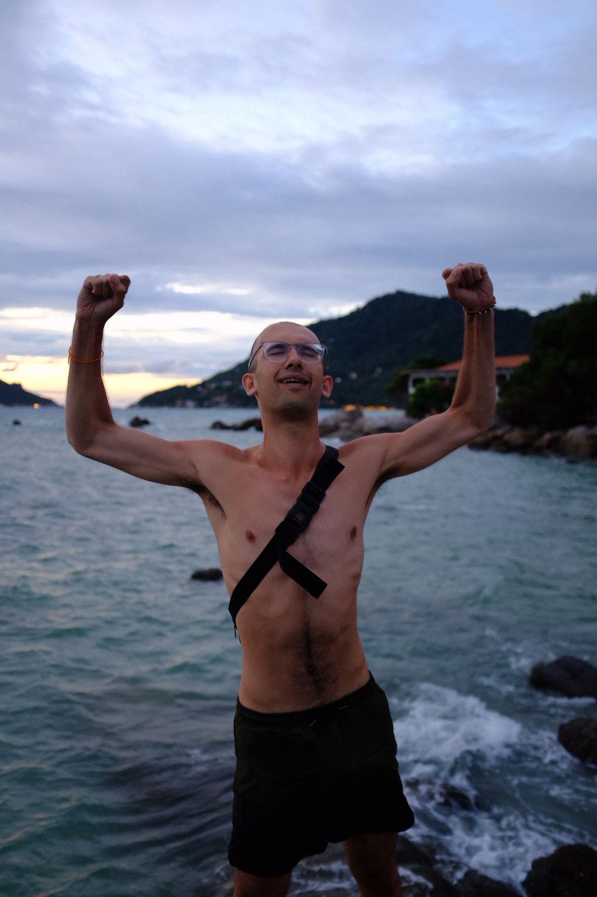

*I've gone bald. At the ripe old age of twenty-two. My George Daniel, Dwyane the Rock Johnson, Yanis Varoufakis amalgamation begins! The long road to my new shiny scalp had its twists and turns. To quote [Stewart Heritage](https://www.theguardian.com/society/2024/apr/16/losing-my-hair-made-me-miserable-now-im-as-bald-as-an-egg-i-couldnt-be-happier),* 

>So baldness is not great. But, hey, we’re men, right? It’s too trivial a subject to get worked up about, even though it makes us paranoid and anxious and has obliterated our sense of self-esteem. Even though we’re suffering through the grief of losing something we’re powerless to keep, we’ve all decided that it’s better just to suffer in silence.

*So, as I finally come to terms with my Androgenetic Alopecia, I thought I'd throw my hat in the elocutionary ring and toast this 'new me' by recording some of these moments on my journey to baldness. A tribute, of sorts, to these pesky follicles which have caused such ridiculous grief!* 

From 19 to 21, I collected enough snapshots to know I was on the long road to a Norwood Five. The penny dropped at the Edinburgh Fringe Festival, aged 20. After dancing all night long to the sweet funk of High Fade in Whistle Binkies, some friends from my troupe and I hiked up Arthur's Seat to see sunrise in. The long trek, the sun creeping over the horizon, basking us in this glorious orange. It was stunning. A real highlight of the Festival for me. 

But when some (hilarious!) videos were shared of our somewhat-sobering descent off the hilltop, a camera caught a top-view of my scalp. I was shocked. You couldn't argue with the morning rays. My hair was thinning. Alot. 

And so began this depressing obsession. This endless flood of mini heart-sink moments. Frantic panicked googling, a 20-page research document on the efficacy of minoxidil, finesteride and demastamps. Avoidance to evade acceptance. Photo from gigs, something not quite right. Handing over my ID at a pub in Cumbria, 'Christ mate, you're looking old!'. Coming back sweaty from a run, a sun-kissed face and exposed forehead. Begrudgingly trying treatments to stem the tide. Occasional jokes, laughed off. 

I became terrified of haircuts, growing it out long as if to boost my defensive armoury which the wind could cut through in a second. When knocking at a friend's door, a pathetic fret over the flow of my thinning locks before they answered. Occasional adjustments from my girlfriend. A joke hairline competition at a party, landing second-worst. Wearing a hat whilst drumming. I became reluctant to shower. Each time, I could see little tuffs tumble to the bathroom floor. I didn't enjoy the reminder. 

Searching for answers, I realised genes and idiocy had created a perfect triple threat. On my Dad's side, all the men rock a strong M-shaped hairline. On my Mum's side, very thin, fine hair with grandpa Syed sporting the monk look. Me? In Lockdown, aged seventeen, I tore at the front of my scalp after a terrible breakup. The perfect cosmic karma after being such an unbelievable arsehole. Lesson learnt. 

As this slow shedding marched forward, unrelenting, I tried to understand, why do I care? Why am I so obsessed and upset? *It's just some hair mate, calm down!*

Hiking in Chiavenna, Italy, with a close friend, I read [*The Descent of Man*](https://www.penguin.co.uk/books/288084/the-descent-of-man-by-perry-grayson/9780141981741) by the inimitable Grayson Perry. It's an attempt to peer into the messy cloud that is modern masculinity. Grayson says we're these status-driven brutes, trained for the savanna, but now placed in a coffee shop. So while we can't compete physically, we find a myriad of proxies to continue the battle. It's not hunting, it's the specificity of your metrosexual coffee addiction, it's your niche music taste, how much you can bench, how many women you've slept with, how fit your girlfriend is, how many drugs you've done, how quickly you can answer a question, your test scores, your job, your hairline. 

We're not all *Wolf of Wall Street* type traders, we're not all coffee snobs, literary critics, jacked Adonises or mathematical wizards. You don't need to top the list in every category. Hell, some advanced Judith Butler reading saint might be able to rise above this puny boneheaded brawl entirely, but for me, I need a few good cards in my hand. And to watch yourself slipping, bit by bit, from 'decent hair' to 'oh christ, you look 30 years old at 22', hurts *one* of these base senses of masculine status. It pulls down one of the pillars you rest your identity upon.

So when I got off the plane from Chiavenna, having made this realisation, verging on self-acceptance, just out of a difficult breakup with three days to spare before I started a new job in a new town without any friends around; I went a little crazy. Running to Argos on a Sunday for clippers, weeping around London listening to *Open My Door* seventeen times, weeping over *Baldcafe* videos, weeping to Mum on the phone. A long charge time was the only barrier between me and a total shave before the first day of the new job. 

Over the next year, it worsened and worsened. Anticipating the end of my year long contract at DESNZ, I began a brutal job hunt in the evenings. As that swallowed my time, I struggled to see and make friends from my middle-of-nowhere town. Just obsessing over my next steps (masters, PhDs, grad schemes, other job applications...) brought careful haircare routines crumbling. I'd be scared to swim, emerging from the water and rushing for my towel. Caught in some Bristol rain without a hood or umbrella, my careful arrangement destroyed. Avoiding the camera in practice room recordings. The bright office lights exposing the scalp beneath my thinning curls. Nervous admissions, self-depreciating humour and over-sharing to pre-diffuse my internal mental paranoia. Endless photos documenting the decline.

It all came to a head whilst travelling South-East Asia. The humid sweat-inducing climate worked ruin on my hair. Up a mountain, dancing in a club, meeting so many new people - with this visible deterioration. 

The cap offered protection. *I promise I'm as young as you!* But I was hiding. Still confident but compromised. A Berliner was joking around in Koh Pha Ngan and - to my horror - lifted my cap. At the Full Moon Party, looking at this sea of people: one of the few guys with a hat after sundown. So many beautiful 20-something guys and 20-something girls, luscious locks abound, mingling with abandon whilst I'm held back in restraint. *I look too old, I don't belong*. For such a firm believer in honesty, in openness and in telling the truth, I was hiding a secret beneath my armour.

So when I found myself kicking the sand of Sairee Beach, Koh Tao, crying to the same songs, about the same fears as I had in my shit town months ago, I couldn't stand it. *I'm done! I've moved on! I want to be free!* I'm about to begin a new chapter: landing in a new town, with this new job, with so many loving and supportive friends around me. I'm ambitious. I have goals I want to achieve. *This hair is irrelevant fluff that I can't carry into this new life.* I want to build things, to work bloody hard and I can't afford to continue suffering this distraction. I needed to rip out this crumbling pillar that had morphed from holding up my sense of identity to poisoning it. 

Thankfully, I have other pillars to hold me up. I've got a decent job, I've been playing drums for years, I'm a moderate maths nerd, an impending coffee snob, bookish, talkative...and beautifully, losing one of these pillars pushes you to build others. For me? It's callisthenics. Jacked bald is better than skinny bald - just look at The Rock! With some new muscle, the edifice of my fraught masculinity can rest easy at night. 

So when I made the trip to this Thai barber, got a 3mm buzz all over and finally exposed my insecurity to the world, I knew exactly where to go: the beach. I threw on my goggles, leaped into the tropical waters and immersed my head under the waves. Swimming through the coral, free. I emerged from the water, ran my head over my scalp and felt this reluctant joy. *There's no need to worry, I've not nothing to hide*. A bittersweet smile spread across my face. I met a German friend, Flo, 'you look so much better (but lose the glasses!)'. We climbed this rock to watch the sun go down. Exhausted, with happy tears in my eyes, I raised my hands in triumph. *I've done it. I'm free.*

The 3mm still exposed too much. The next day, I went straight to another barber in Phuket. Two-hundred Bhat, a zero guard and some joyful tears later; it's all off. Gone. Yes, I look like an egg. But it's an egg with a pretty big bloody grin. I read [Walcott](https://archive.org/details/collectedpoems190000walc) with satisfaction, clear in mind, body and spirit and ready for my next exciting chapter in life. 

>Love After Love - Derrick Walcott
>
>The time will come  
>when, with elation  
>you will greet yourself arriving  
>at your own door, in your own mirror  
>and each will smile at the other's welcome,
>
>and say, sit here. Eat.  
>You will love again the stranger who was your self.  
>Give wine. Give bread. Give back your heart  
>to itself, to the stranger who has loved you
>
>all your life, whom you ignored  
>for another, who knows you by heart.  
>Take down the love letters from the bookshelf,
>
>the photographs, the desperate notes,  
>peel your own image from the mirror.  
>Sit. Feast on your life.

